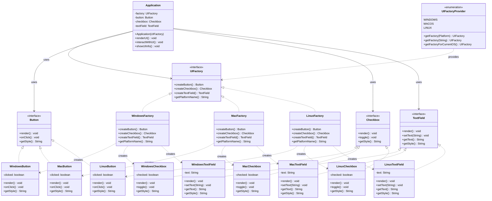

# Abstract Factory Pattern - Class Diagram

## Key Relationships

1. **Factory Hierarchy**: All concrete factories implement UIFactory interface
2. **Product Hierarchies**: Each UI component type has platform-specific implementations
3. **Family Consistency**: Each factory creates components from the same platform family
4. **Client Independence**: Application works with abstract interfaces only
5. **Factory Provider**: Encapsulates factory selection logic

## Benefits Demonstrated

- **Consistency**: All components from same factory have consistent styling
- **Isolation**: Client code isolated from concrete product classes
- **Flexibility**: Easy to add new platform families
- **Encapsulation**: Product creation logic encapsulated in factories 