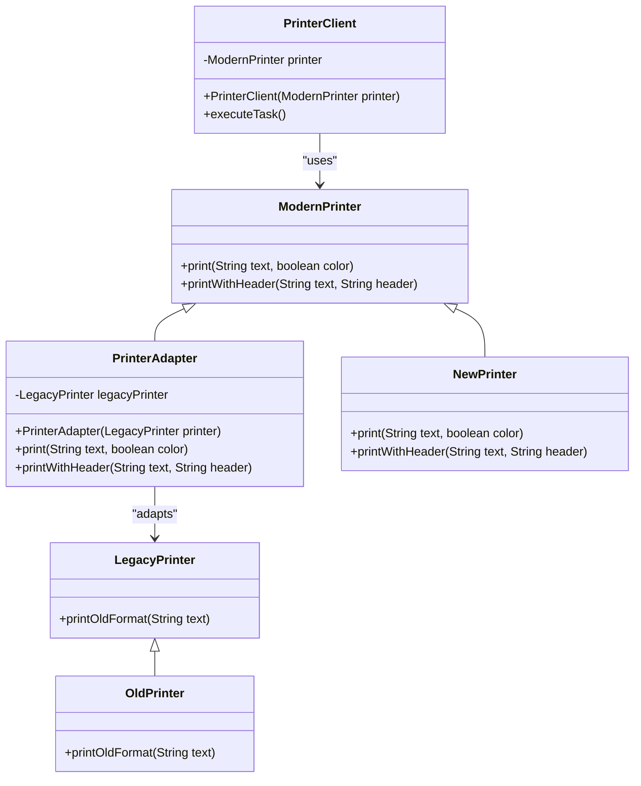

# Adapter Pattern Diagram

The diagram shows how the Adapter pattern works:
- **LegacyPrinter**: The old interface we cannot modify
- **PrinterAdapter**: The adapter that implements the new interface while using the legacy printer
- **ModernPrinter**: The new interface our system expects
- **PrinterClient**: The client that only knows about the modern interface 