# Builder Pattern - Visual Diagrams

## 🏗️ UML Class Diagram

```mermaid
classDiagram
    class Computer {
        -String cpu
        -int ram
        -int storage
        -String gpu
        -boolean bluetooth
        -boolean wifi
        -String operatingSystem
        -String caseColor
        -boolean liquidCooling
        -int powerSupply
        -String motherboard
        
        -Computer(ComputerBuilder builder)
        +getCpu() String
        +getRam() int
        +getStorage() int
        +toString() String
        +calculatePrice() double
    }
    
    class ComputerBuilder {
        -String cpu
        -int ram
        -int storage
        -String gpu
        -boolean bluetooth
        -boolean wifi
        -String operatingSystem
        -String caseColor
        -boolean liquidCooling
        -int powerSupply
        -String motherboard
        
        +ComputerBuilder(String cpu, int ram, int storage)
        +gpu(String gpu) ComputerBuilder
        +bluetooth(boolean bluetooth) ComputerBuilder
        +wifi(boolean wifi) ComputerBuilder
        +operatingSystem(String os) ComputerBuilder
        +caseColor(String color) ComputerBuilder
        +liquidCooling(boolean cooling) ComputerBuilder
        +powerSupply(int watts) ComputerBuilder
        +motherboard(String mb) ComputerBuilder
        +build() Computer
        +gamingPreset() ComputerBuilder
        +officePreset() ComputerBuilder
        +workstationPreset() ComputerBuilder
    }
    
    class ComputerDirector {
        +buildGamingComputer() Computer
        +buildOfficeComputer() Computer
        +buildWorkstation() Computer
        +buildBudgetComputer() Computer
        +buildCustomComputer(String cpu, int ram, int storage, Function customizer) Computer
    }
    
    class ComputerStore {
        -ComputerDirector director
        -List~Computer~ inventory
        +ComputerStore()
        -setupInventory() void
        +showInventory() void
        +customBuild(String cpu, int ram, int storage) Computer
    }
    
    Computer +-- ComputerBuilder : nested class
    ComputerDirector ..> ComputerBuilder : uses
    ComputerStore --> ComputerDirector : uses
    ComputerBuilder ..> Computer : creates
```

## 🔄 Sequence Diagram - Computer Building Process


## 🏗️ Builder Construction Flow

```mermaid
flowchart TD
    A[Client Needs Computer] --> B{Construction Method}
    B -->|Simple| C[Direct Builder Usage]
    B -->|Complex| D[Director-Managed]
    B -->|Standard| E[Preset Configuration]
    
    C --> F[new ComputerBuilder<br/>cpu, ram, storage]
    F --> G[Add Optional Components]
    G --> H[Method Chaining]
    H --> I[build()]
    
    D --> J[Director.buildGamingComputer]
    J --> K[Director Uses Builder]
    K --> L[Apply Gaming Preset]
    L --> I
    
    E --> M[Builder.gamingPreset]
    M --> N[Pre-configured Components]
    N --> I
    
    I --> O[Computer Instance]
    
    style C fill:#e1f5fe
    style D fill:#f3e5f5
    style E fill:#fff3e0
    style O fill:#e8f5e8
```

## 🔧 Method Chaining Visualization

```mermaid
graph LR
    A[new ComputerBuilder<br/>"Intel i7", 32, 1000] --> B[.gpu<br/>"RTX 4070"]
    B --> C[.wifi<br/>true]
    C --> D[.bluetooth<br/>true]
    D --> E[.liquidCooling<br/>true]
    E --> F[.powerSupply<br/>750]
    F --> G[.operatingSystem<br/>"Windows 11"]
    G --> H[.build<br/>Computer]
    
    style A fill:#ffecb3
    style H fill:#c8e6c9
```

## 📊 Builder Pattern Components


## 🎯 Construction Strategies Comparison

```mermaid
graph TB
    subgraph "Construction Approaches"
        A[Direct Constructor<br/>❌ Too many parameters]
        B[Telescoping Constructor<br/>❌ Multiple overloads]
        C[JavaBean Pattern<br/>❌ Mutable, inconsistent state]
        D[Builder Pattern<br/>✅ Flexible, immutable, readable]
    end
    
    subgraph "Builder Benefits"
        E[Method Chaining<br/>🔗]
        F[Preset Configurations<br/>⚙️]
        G[Validation<br/>✅]
        H[Immutability<br/>🔒]
    end
    
    D --> E
    D --> F
    D --> G
    D --> H
    
    style A fill:#ffcdd2
    style B fill:#ffcdd2
    style C fill:#fff3e0
    style D fill:#c8e6c9
```



## 🔄 Builder Lifecycle


## 💰 Price Calculation Flow


## 🔗 Pattern Relationships


## 💡 Key Design Insights

### 1. **Required vs Optional Parameters**
```
Constructor: ComputerBuilder(cpu, ram, storage)  // Required
Methods: .gpu(), .wifi(), .bluetooth()           // Optional
```

### 2. **Fluent Interface Pattern**
```
Each method returns 'this' → Method chaining possible
```

### 3. **Preset Strategy**
```
Preset methods group related configurations
gamingPreset() = gpu + cooling + power + connectivity
```

---

*Visual diagrams demonstrate how the Builder pattern handles complex object construction with flexibility and readability.* 