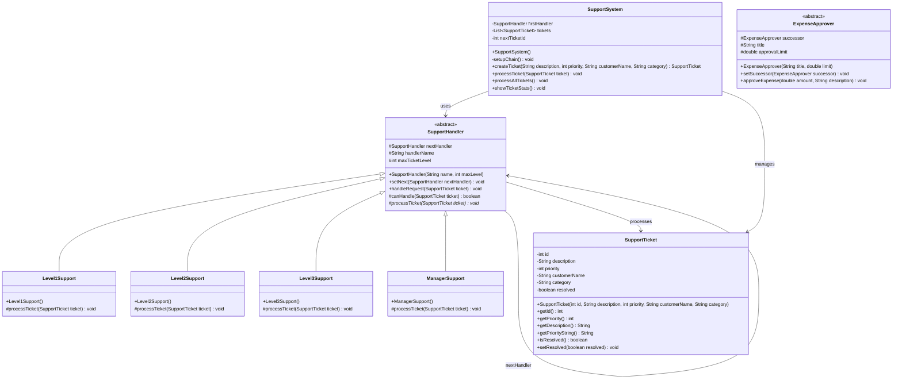
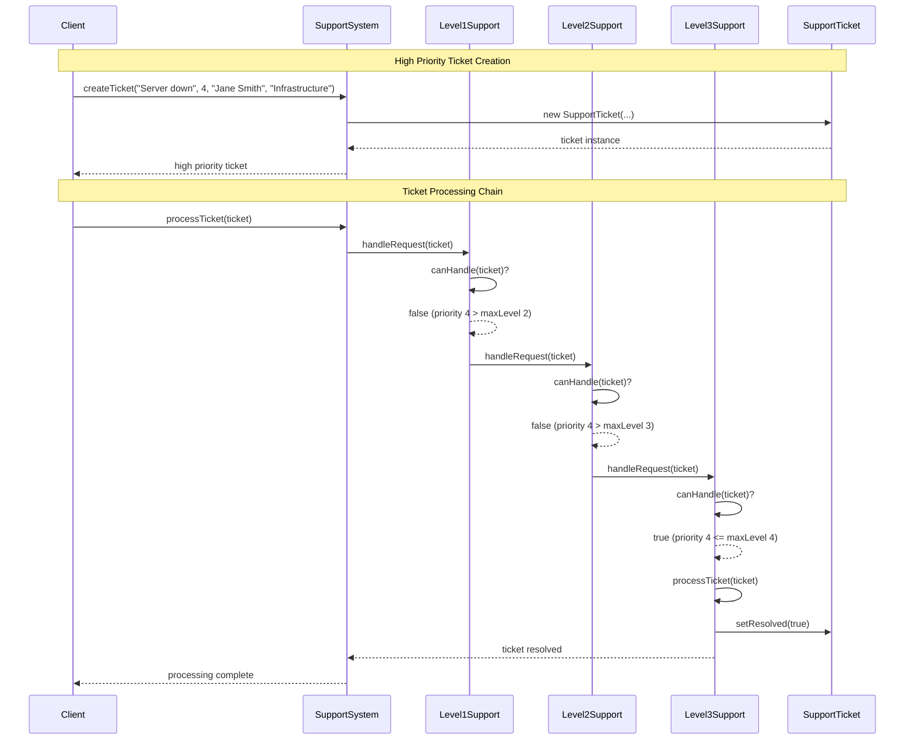
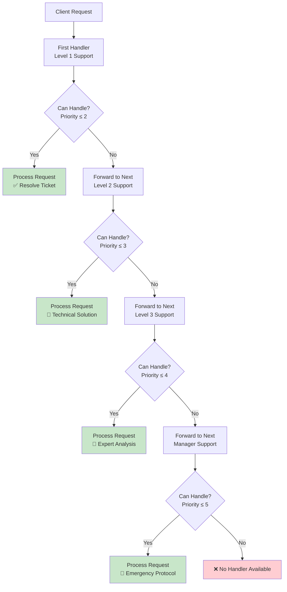
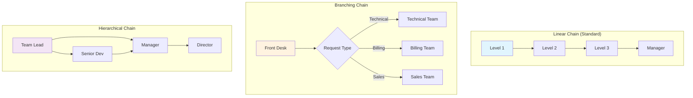
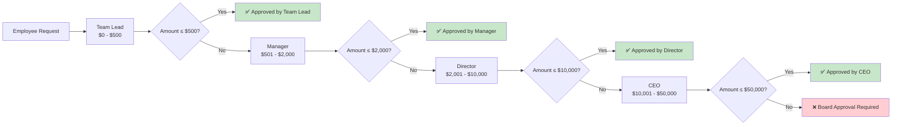
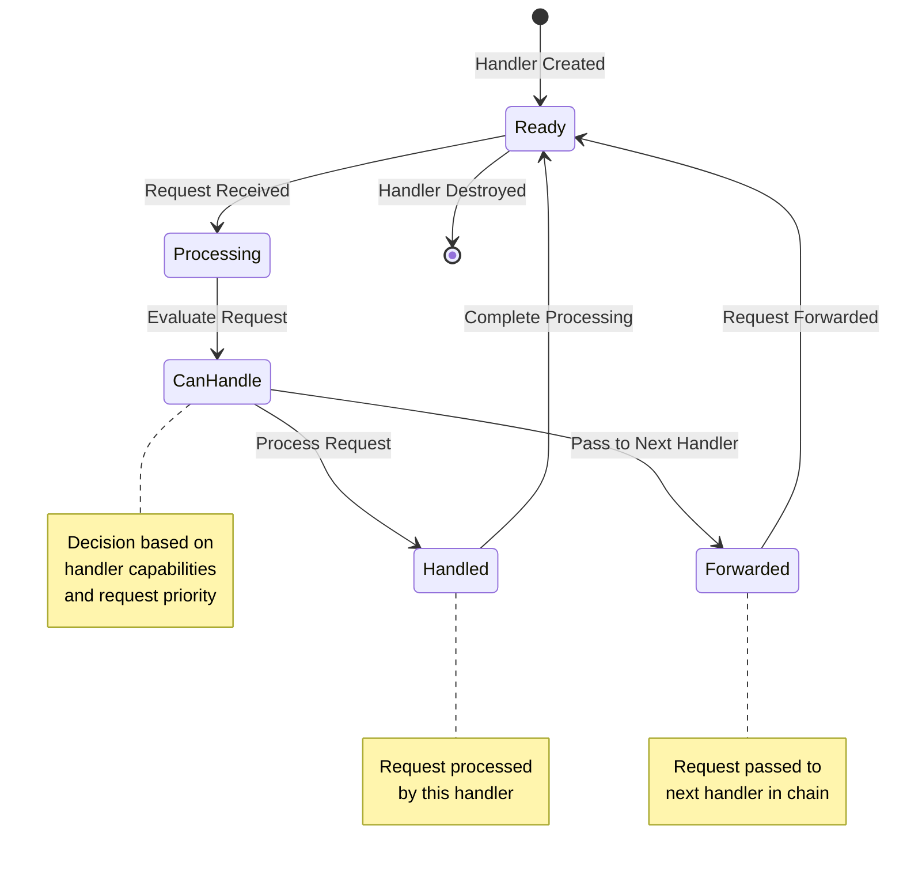
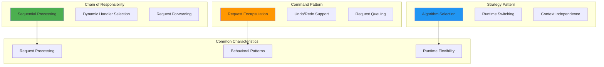
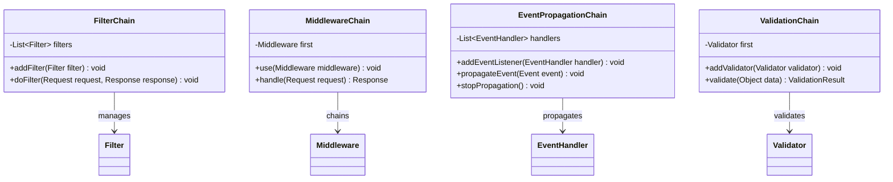

# Chain of Responsibility Pattern - Visual Diagrams

## 🏗️ UML Class Diagram



## 🔄 Sequence Diagram - Support Ticket Processing



## 🎯 Chain Request Flow



## 📊 Chain of Responsibility Structure

```mermaid
mindmap
  root((Chain of Responsibility))
    Abstract Handler
      Request Interface
        handleRequest()
        canHandle()
        processTicket()
      Chain Management
        nextHandler reference
        setNext() method
        Forward to successor
      
    Concrete Handlers
      Level1Support
        Basic issues
        Priority ≤ 2
        Standard solutions
      Level2Support
        Technical issues
        Priority ≤ 3
        System analysis
      Level3Support
        Expert issues
        Priority ≤ 4
        Custom solutions
      ManagerSupport
        Emergency issues
        Priority ≤ 5
        Executive involvement
    
    Request Object
      SupportTicket
        Priority level
        Description
        Customer info
        Category
        Resolution status
    
    Client System
      SupportSystem
        Chain setup
        Ticket creation
        Request routing
        Statistics tracking
```

## 🔗 Chain Configuration Patterns



## 💰 Expense Approval Chain



## 🔄 Handler State Management



## 📈 Performance Characteristics

```mermaid
graph LR
    subgraph "Chain Traversal Performance"
        A[Best Case<br/>O(1)]
        B[Average Case<br/>O(n/2)]
        C[Worst Case<br/>O(n)]
    end
    
    subgraph "Factors Affecting Performance"
        D[Chain Length<br/>📏]
        E[Handler Complexity<br/>⚙️]
        F[Request Distribution<br/>📊]
    end
    
    subgraph "Optimization Strategies"
        G[Priority Ordering<br/>📋]
        H[Caching Results<br/>💾]
        I[Handler Statistics<br/>📈]
    end
    
    A --> G
    B --> H
    C --> I
    
    D --> A
    E --> B
    F --> C
    
    style A fill:#c8e6c9
    style B fill:#fff3e0
    style C fill:#ffcdd2
```

## 🆚 Chain vs Other Patterns



## 🔧 Implementation Variations



## 💡 Key Design Insights

### 1. **Handler Responsibility**
```
Each handler should have a single, clear responsibility
Handlers should be independent and loosely coupled
```

### 2. **Chain Termination**
```
Always provide a way to handle "unhandled" requests
Consider default handlers at the end of chain
```

### 3. **Request Information**
```
Request objects should contain all necessary information
Handlers shouldn't need external context to make decisions
```

---

*Visual diagrams illustrate how the Chain of Responsibility pattern enables flexible request processing through a series of loosely coupled handlers.* 