# Command Pattern - Visual Diagrams

## 🏗️ UML Class Diagram


## 🔄 Sequence Diagram - Command Execution with Undo


## 📝 Command Execution Flow

```mermaid
flowchart TD
    A[Client Creates Command] --> B[Command Object<br/>InsertCommand]
    B --> C[Invoker.executeCommand]
    C --> D[Command.execute]
    D --> E[Receiver.insertText]
    E --> F[Push to Undo Stack]
    F --> G[Clear Redo Stack]
    
    H[Client Calls Undo] --> I[Pop from Undo Stack]
    I --> J[Command.undo]
    J --> K[Receiver.deleteText]
    K --> L[Push to Redo Stack]
    
    M[Client Calls Redo] --> N[Pop from Redo Stack]
    N --> O[Command.execute]
    O --> P[Receiver.insertText]
    P --> Q[Push to Undo Stack]
    
    style A fill:#e1f5fe
    style H fill:#fff3e0
    style M fill:#f3e5f5
    style F fill:#c8e6c9
    style L fill:#c8e6c9
    style Q fill:#c8e6c9
```



## 🎯 Command Pattern Components

```mermaid
mindmap
  root((Command Pattern))
    Command Interface
      Common Contract
        execute()
        undo()
        getDescription()
      Behavioral Definition
        Defines what all commands must implement
        Ensures consistent interface
    
    Concrete Commands
      InsertCommand
        Text insertion
        Position tracking
        Undo by deletion
      DeleteCommand
        Text deletion
        Content preservation
        Undo by insertion
      ReplaceCommand
        Text replacement
        Original text storage
        Undo by restore
      MacroCommand
        Composite commands
        Sequential execution
        Reverse undo order
    
    Receiver
      TextEditor
        Content management
        Cursor positioning
        Text operations
      Light
        Device state
        Brightness control
        On/off operations
    
    Invoker
      EditorInvoker
        Command execution
        History management
        Undo/Redo stacks
        Command validation
```

## 🔄 Macro Command Structure

```mermaid
graph TD
    A[MacroCommand: "Format Text"] --> B[Command 1<br/>InsertCommand]
    A --> C[Command 2<br/>ReplaceCommand]
    A --> D[Command 3<br/>DeleteCommand]
    
    E[Execute Macro] --> F[Execute Command 1]
    F --> G[Execute Command 2]
    G --> H[Execute Command 3]
    
    I[Undo Macro] --> J[Undo Command 3]
    J --> K[Undo Command 2]
    K --> L[Undo Command 1]
    
    style A fill:#ffeb3b
    style E fill:#4caf50
    style I fill:#ff9800
```

## 📚 Command History Management


## 🏠 Smart Home Command Example


## ⚡ Command vs Strategy vs State


## 🔧 Command Implementation Patterns


## 💡 Key Design Insights

### 1. **Request Encapsulation**
```
Traditional: client.method(params)
Command: invoker.execute(new MethodCommand(client, params))
```

### 2. **Undo Implementation**
```
Store state before execution
Undo reverses the operation
Redo re-executes the command
```

### 3. **Macro Commands**
```
Composite pattern structure
Execute in order
Undo in reverse order
```

---

*Visual diagrams illustrate how the Command pattern encapsulates requests as objects, enabling flexible operation management, undo/redo functionality, and command composition.* 