# Composite Pattern - Visual Diagrams

## 🏗️ UML Class Diagram


## 🔄 Sequence Diagram - File System Operations

```mermaid
sequenceDiagram
    participant Client
    participant FileManager
    participant RootDirectory
    participant SubDirectory
    participant File1
    participant File2
    
    Note over Client, File2: Building File System Structure
    Client->>FileManager: new FileManager(rootDirectory)
    FileManager-->>Client: file manager created
    
    Client->>FileManager: createDirectory("/docs")
    FileManager->>RootDirectory: add(docsDirectory)
    RootDirectory-->>FileManager: directory added
    
    Client->>FileManager: createFile("/docs/readme.txt", "txt", 1024)
    FileManager->>SubDirectory: add(readmeFile)
    SubDirectory-->>FileManager: file added
    
    Note over Client, File2: Display Structure Operation
    Client->>FileManager: displayStructure()
    FileManager->>RootDirectory: display(0)
    RootDirectory->>RootDirectory: print directory info
    RootDirectory->>SubDirectory: display(1)
    SubDirectory->>SubDirectory: print directory info
    SubDirectory->>File1: display(2)
    File1->>File1: print file info
    File1-->>SubDirectory: display complete
    SubDirectory-->>RootDirectory: display complete
    RootDirectory-->>FileManager: display complete
    FileManager-->>Client: structure displayed
    
    Note over Client, File2: Calculate Total Size
    Client->>FileManager: getTotalSize()
    FileManager->>RootDirectory: calculateTotalSize()
    RootDirectory->>SubDirectory: calculateTotalSize()
    SubDirectory->>File1: calculateTotalSize()
    File1-->>SubDirectory: 1024 bytes
    SubDirectory->>File2: calculateTotalSize()
    File2-->>SubDirectory: 512 bytes
    SubDirectory-->>RootDirectory: 1536 bytes
    RootDirectory-->>FileManager: total size
    FileManager-->>Client: 1536 bytes
```



## 🌳 Composite Tree Structure

```mermaid
graph TD
    A[Root Directory<br/>"/"] --> B[Documents<br/>"/docs"]
    A --> C[Images<br/>"/images"]
    A --> D[config.txt<br/>512 bytes]
    
    B --> E[Projects<br/>"/docs/projects"]
    B --> F[readme.md<br/>1024 bytes]
    B --> G[notes.txt<br/>256 bytes]
    
    C --> H[photo1.jpg<br/>2048 bytes]
    C --> I[photo2.png<br/>1536 bytes]
    
    E --> J[project1<br/>"/docs/projects/project1"]
    E --> K[project2<br/>"/docs/projects/project2"]
    
    J --> L[main.java<br/>4096 bytes]
    J --> M[test.java<br/>2048 bytes]
    
    K --> N[app.py<br/>3072 bytes]
    K --> O[data.json<br/>1024 bytes]
    
    classDef directory fill:#e3f2fd
    classDef file fill:#fff3e0
    
    class A,B,C,E,J,K directory
    class D,F,G,H,I,L,M,N,O file
```

## 📊 Composite Pattern Components

```mermaid
mindmap
  root((Composite Pattern))
    Component Interface
      Common Operations
        display()
        calculateTotalSize()
        search()
      Tree Navigation
        add()
        remove()
        getChild()
      Uniform Interface
        Treats leaf and composite uniformly
        Client doesn't distinguish types
    
    Leaf Components
      File
        Contains actual data
        No child components
        Implements operations directly
        Terminal nodes in tree
      Specific Behaviors
        File extension handling
        Content management
        Size calculation
    
    Composite Components
      Directory
        Contains child components
        Delegates operations to children
        Manages collection of components
        Can contain both files and directories
      Collection Management
        Add/remove children
        Iterate over children
        Aggregate results from children
    
    Client Usage
      FileManager
        Works with component interface
        Doesn't know specific types
        Performs operations recursively
        Manages entire tree structure
```

## 🔄 Operation Delegation Flow

```mermaid
flowchart TD
    A[Client Request<br/>calculateTotalSize()] --> B[Root Directory]
    B --> C{Has Children?}
    C -->|Yes| D[Iterate Children]
    C -->|No| E[Return Own Size]
    
    D --> F[Child 1: Directory]
    D --> G[Child 2: File]
    D --> H[Child 3: File]
    
    F --> I[Recursive Call<br/>calculateTotalSize()]
    I --> J[Sum of Subdirectory<br/>Children Sizes]
    
    G --> K[Return File Size<br/>1024 bytes]
    H --> L[Return File Size<br/>512 bytes]
    
    J --> M[Aggregate Results]
    K --> M
    L --> M
    
    M --> N[Total: 3072 bytes]
    N --> O[Return to Client]
    
    style A fill:#e1f5fe
    style F fill:#f3e5f5
    style G fill:#fff3e0
    style H fill:#fff3e0
    style O fill:#c8e6c9
```

## 🔍 Search Operation Pattern

```mermaid
flowchart TD
    A[Search: "*.java"] --> B[Root Directory]
    B --> C[Check Own Name]
    C --> D{Matches Pattern?}
    D -->|No| E[Check Children]
    D -->|Yes| F[Add to Results]
    
    E --> G[Child 1: docs/]
    E --> H[Child 2: images/]
    E --> I[Child 3: config.txt]
    
    G --> J[Recursive Search<br/>in docs/]
    H --> K[Recursive Search<br/>in images/]
    I --> L[Check File Name]
    
    J --> M[Found: main.java<br/>test.java]
    K --> N[No matches]
    L --> O[No match]
    
    M --> P[Collect Results]
    N --> P
    O --> P
    
    P --> Q[Return: [main.java, test.java]]
    
    style A fill:#e1f5fe
    style M fill:#c8e6c9
    style Q fill:#c8e6c9
```

## 🏗️ File System Structure Examples


## ⚡ Performance Characteristics

```mermaid
graph TB
    subgraph "Operation Complexity"
        A[Display: O(n)]
        B[Search: O(n)]
        C[Calculate Size: O(n)]
        D[Add/Remove: O(1)]
    end
    
    subgraph "Tree Depth Impact"
        E[Shallow Tree<br/>Better Cache Locality]
        F[Deep Tree<br/>More Recursive Calls]
        G[Balanced Tree<br/>Optimal Performance]
    end
    
    subgraph "Memory Usage"
        H[File Objects<br/>Minimal Memory]
        I[Directory Objects<br/>Child Collection Overhead]
        J[Large Trees<br/>Significant Memory Usage]
    end
    
    A --> E
    B --> F
    C --> G
    
    H --> A
    I --> B
    J --> C
    
    style A fill:#c8e6c9
    style E fill:#c8e6c9
    style H fill:#c8e6c9
    style F fill:#ffcdd2
    style J fill:#ffcdd2
```

## 🔄 Composite vs Decorator


## 🎯 Design Decisions


## 💡 Key Design Insights

### 1. **Uniform Treatment**
```
Both files and directories implement same interface
Client code works with abstractions, not concrete types
Operations can be applied uniformly across the tree
```

### 2. **Recursive Structure**
```
Composites contain other composites and leaves
Operations naturally traverse the tree structure
Each level handles its own part of the operation
```

### 3. **Transparency vs Safety**
```
Transparency: All components have same interface (may include unused methods)
Safety: Only composites have child management methods (requires type checking)
```

---

*Visual diagrams demonstrate how the Composite pattern enables uniform treatment of individual objects and compositions in a tree structure.* 