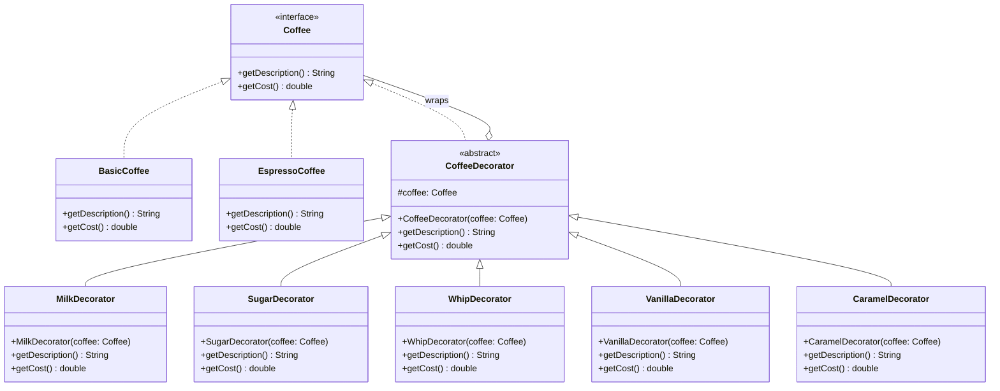
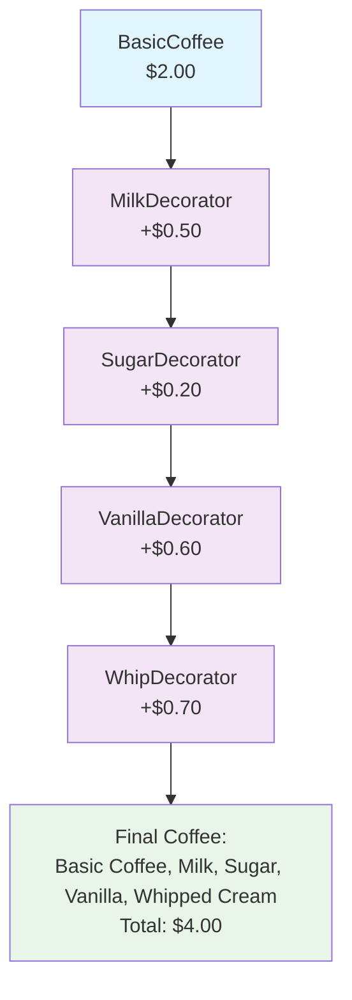
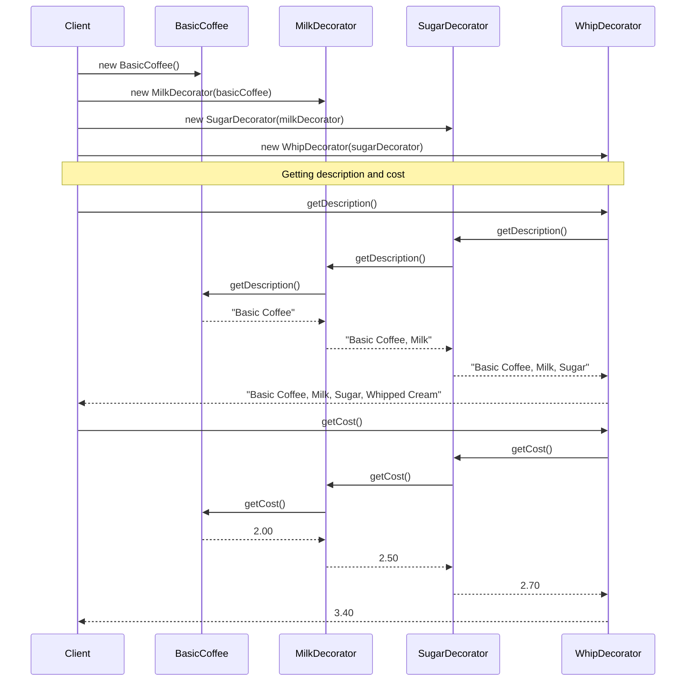
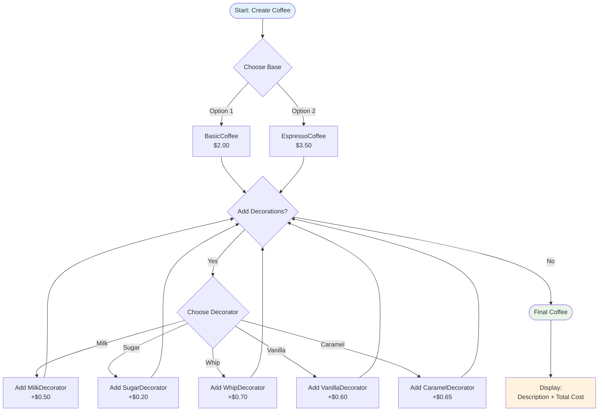

# Decorator Pattern - Visual Diagrams

## 1. Class Diagram



## 2. Object Composition Diagram



## 3. Decorator Pattern Structure

```mermaid
graph LR
    subgraph "Component Interface"
        CI[Coffee Interface<br/>- getDescription()<br/>- getCost()]
    end
    
    subgraph "Concrete Components"
        CC1[BasicCoffee<br/>Basic Coffee - $2.00]
        CC2[EspressoCoffee<br/>Espresso - $3.50]
    end
    
    subgraph "Base Decorator"
        BD[CoffeeDecorator<br/>- coffee: Coffee<br/>+ delegates to wrapped object]
    end
    
    subgraph "Concrete Decorators"
        CD1[MilkDecorator<br/>+$0.50]
        CD2[SugarDecorator<br/>+$0.20]
        CD3[WhipDecorator<br/>+$0.70]
        CD4[VanillaDecorator<br/>+$0.60]
        CD5[CaramelDecorator<br/>+$0.65]
    end
    
    CI --> CC1
    CI --> CC2
    CI --> BD
    BD --> CD1
    BD --> CD2
    BD --> CD3
    BD --> CD4
    BD --> CD5
    
    style CI fill:#ffeb3b
    style BD fill:#ff9800
    style CC1 fill:#4caf50
    style CC2 fill:#4caf50
```

## 4. Sequence Diagram - Creating Decorated Coffee



## 5. Runtime Decoration Process



## 6. Memory Structure Visualization

```mermaid
graph TB
    subgraph "Memory Layout"
        subgraph "Outermost Decorator"
            WD[WhipDecorator<br/>cost: +0.70<br/>description: +Whipped Cream]
        end
        
        subgraph "Middle Decorator"
            SD[SugarDecorator<br/>cost: +0.20<br/>description: +Sugar]
        end
        
        subgraph "Inner Decorator"
            MD[MilkDecorator<br/>cost: +0.50<br/>description: +Milk]
        end
        
        subgraph "Core Component"
            BC[BasicCoffee<br/>cost: 2.00<br/>description: Basic Coffee]
        end
    end
    
    WD -->|wraps| SD
    SD -->|wraps| MD
    MD -->|wraps| BC
    
    subgraph "Method Call Chain"
        C1[getCost(): 3.40] --> C2[getCost(): 2.70]
        C2 --> C3[getCost(): 2.50]
        C3 --> C4[getCost(): 2.00]
        
        D1[getDescription():<br/>Basic Coffee, Milk, Sugar, Whipped Cream] --> D2[getDescription():<br/>Basic Coffee, Milk, Sugar]
        D2 --> D3[getDescription():<br/>Basic Coffee, Milk]
        D3 --> D4[getDescription():<br/>Basic Coffee]
    end
    
    style WD fill:#ffcdd2
    style SD fill:#f8bbd9
    style MD fill:#e1bee7
    style BC fill:#c8e6c9
```

## Key Diagram Insights

1. **Layered Structure**: Each decorator wraps the previous component, creating a nested structure
2. **Interface Consistency**: All decorators implement the same Coffee interface
3. **Delegation Chain**: Method calls are delegated through the decorator chain to the core component
4. **Runtime Composition**: Decorators can be combined in any order and quantity
5. **Transparent Enhancement**: Clients interact with decorated objects the same way as base components
6. **Cost Accumulation**: Each decorator adds its cost to the wrapped component's cost
7. **Description Building**: Each decorator appends its description to the wrapped component's description 