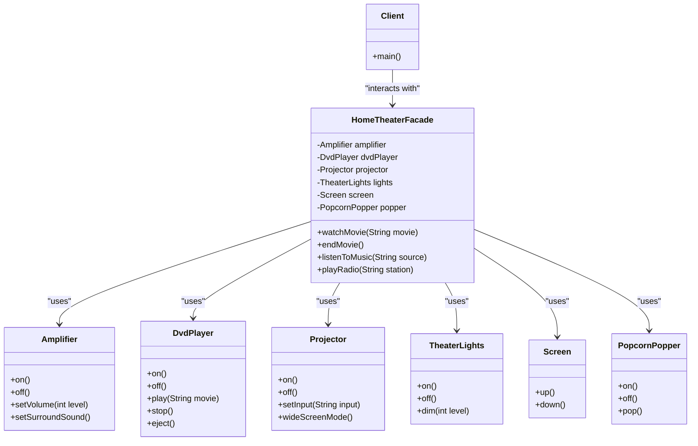

# Facade Pattern Diagram

The diagram illustrates:
- **HomeTheaterFacade**: Provides a simplified interface to the complex subsystem
- **Subsystem Classes**: Complex components (Amplifier, DvdPlayer, etc.) that work together
- **Client**: Only needs to interact with the facade, not individual subsystem components
- **Composition**: The facade contains references to all subsystem components 