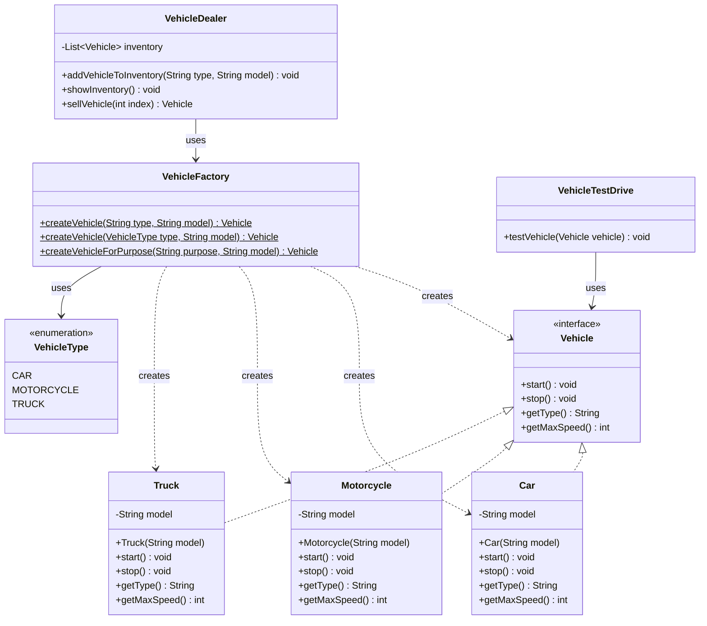
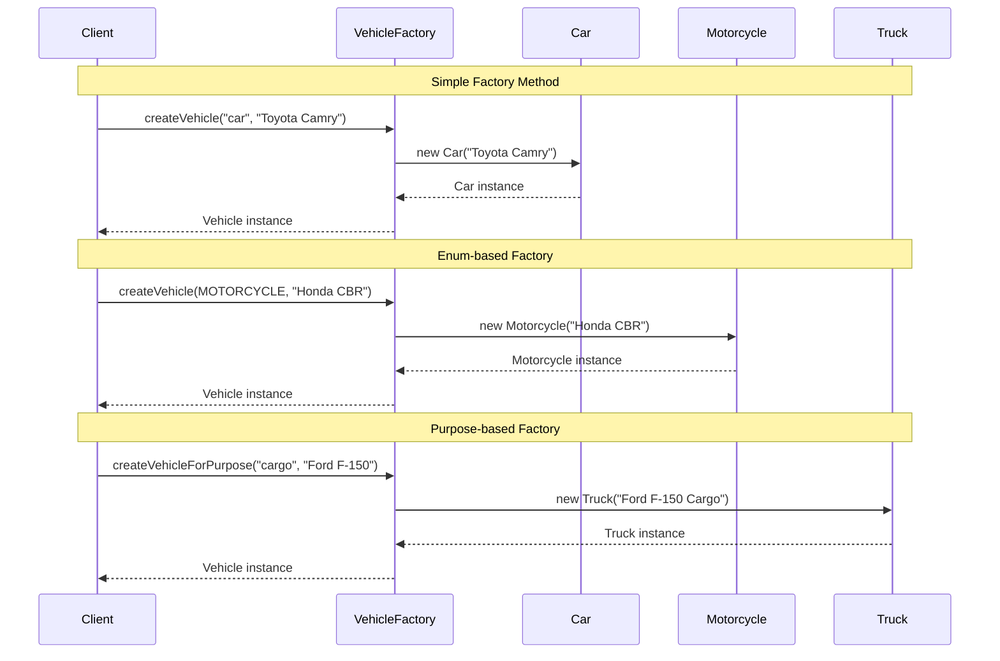

# Factory Pattern - Visual Diagrams

## 🏗️ UML Class Diagram



## 🔄 Sequence Diagram - Vehicle Creation Process



## 🏪 Factory Interaction Flow

```mermaid
flowchart TD
    A[Client Request] --> B{Factory Method}
    B -->|String Type| C[Simple Factory]
    B -->|Enum Type| D[Type-Safe Factory]
    B -->|Purpose| E[Purpose-Based Factory]
    
    C --> F{Validate Type}
    F -->|"car"| G[Create Car]
    F -->|"motorcycle"| H[Create Motorcycle]
    F -->|"truck"| I[Create Truck]
    F -->|Invalid| J[Throw Exception]
    
    D --> K{Switch on Enum}
    K -->|CAR| G
    K -->|MOTORCYCLE| H
    K -->|TRUCK| I
    
    E --> L{Purpose Analysis}
    L -->|"family"/"daily"| M[Create Family Car]
    L -->|"adventure"/"sport"| N[Create Sport Motorcycle]
    L -->|"delivery"/"cargo"| O[Create Cargo Truck]
    L -->|Default| P[Create Standard Car]
    
    G --> Q[Return Vehicle]
    H --> Q
    I --> Q
    M --> Q
    N --> Q
    O --> Q
    P --> Q
    J --> R[Error Response]
```

## 🎭 Factory Method Variations

```mermaid
graph LR
    subgraph "Factory Strategies"
        A[String-based Factory<br/>createVehicle(String, String)]
        B[Enum-based Factory<br/>createVehicle(VehicleType, String)]
        C[Purpose-based Factory<br/>createVehicleForPurpose(String, String)]
    end
    
    subgraph "Benefits"
        D[Type Safety<br/>🛡️]
        E[Flexibility<br/>🔄]
        F[Business Logic<br/>💼]
    end
    
    subgraph "Use Cases"
        G[User Input<br/>📝]
        H[Configuration<br/>⚙️]
        I[Smart Defaults<br/>🧠]
    end
    
    A --> G
    B --> D
    B --> H
    C --> F
    C --> I
    D --> E
```

## 📊 Pattern Components Overview

```mermaid
mindmap
  root((Factory Pattern))
    Product Interface
      Vehicle
        start()
        stop()
        getType()
        getMaxSpeed()
    
    Concrete Products
      Car
        Key ignition
        200 km/h max speed
      Motorcycle
        Kick/Button start
        180 km/h max speed
      Truck
        Diesel engine
        120 km/h max speed
    
    Factory Class
      Static Methods
        Simple Factory
        Enum Factory
        Purpose Factory
      Error Handling
        Validation
        Exceptions
    
    Client Usage
      VehicleDealer
        Inventory management
      VehicleTestDrive
        Vehicle testing
```

## 🔗 Factory Method Decision Tree

```mermaid
flowchart TD
    Start([Need to Create Vehicle]) --> Q1{Know Exact Type?}
    Q1 -->|Yes| Q2{Type Safety Important?}
    Q1 -->|No| Purpose[Use Purpose-Based Factory]
    
    Q2 -->|Yes| Enum[Use Enum Factory<br/>VehicleType.CAR]
    Q2 -->|No| String[Use String Factory<br/>"car"]
    
    Purpose --> PurposeEx["createVehicleForPurpose('family', model)"]
    Enum --> EnumEx["createVehicle(VehicleType.CAR, model)"]
    String --> StringEx["createVehicle('car', model)"]
    
    PurposeEx --> Result[Vehicle Instance]
    EnumEx --> Result
    StringEx --> Result
    
    style Purpose fill:#e1f5fe
    style Enum fill:#f3e5f5
    style String fill:#fff3e0
    style Result fill:#e8f5e8
```

## 💡 Key Design Insights

### 1. **Abstraction Layers**
```
Client Code
    ↓
VehicleFactory (Abstraction)
    ↓
Concrete Vehicle Classes (Implementation)
```

### 2. **Dependency Direction**
- **Before Factory**: Client → Concrete Classes (tight coupling)
- **After Factory**: Client → Factory → Concrete Classes (loose coupling)

### 3. **Extension Points**
- Adding new vehicle types only requires:
  1. New concrete class implementing Vehicle
  2. Update factory switch/if statements
  3. No client code changes needed

---

*Visual diagrams help understand the Factory pattern's structure and interactions between components.* 