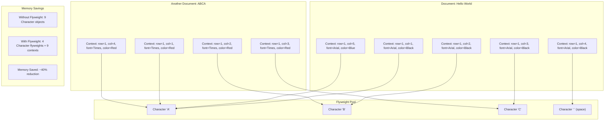
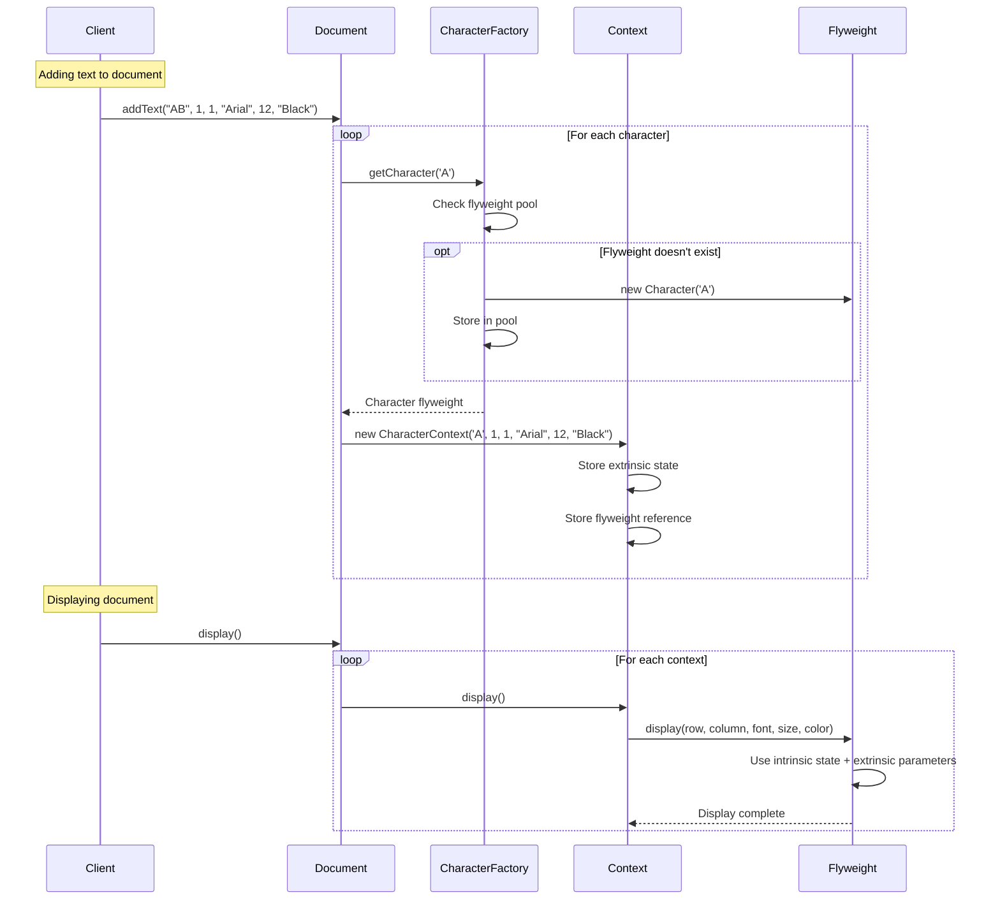

# Flyweight Pattern - Class Diagram

```mermaid
classDiagram
    %% Core Flyweight Interface
    class CharacterFlyweight {
        <<interface>>
        +display(int, int, String, int, String) void
    }
    
    %% Concrete Flyweight
    class Character {
        -character: char
        +Character(char)
        +display(int, int, String, int, String) void
        +getCharacter() char
    }
    
    %% Flyweight Factory
    class CharacterFactory {
        -flyweights: Map~Character,CharacterFlyweight~$
        -creationCount: int$
        +getCharacter(char) CharacterFlyweight$
        +getCreationCount() int$
        +getFlyweightCount() int$
        +showStatistics() void$
    }
    
    %% Context Class
    class CharacterContext {
        -row: int
        -column: int
        -font: String
        -size: int
        -color: String
        -flyweight: CharacterFlyweight
        +CharacterContext(char, int, int, String, int, String)
        +display() void
        +setPosition(int, int) void
        +setFont(String) void
        +setSize(int) void
        +setColor(String) void
    }
    
    %% Document Class
    class Document {
        -characters: List~CharacterContext~
        -documentName: String
        +Document(String)
        +addCharacter(char, int, int, String, int, String) void
        +addText(String, int, int, String, int, String) void
        +display() void
        +getCharacterCount() int
        +showMemoryUsage() void
    }
    
    %% Particle System Example
    class ParticleFlyweight {
        <<interface>>
        +move(double, double, double, double, String, double) void
    }
    
    class ParticleType {
        -name: String
        -texture: String
        -behavior: String
        +ParticleType(String, String, String)
        +move(double, double, double, double, String, double) void
        +getName() String
    }
    
    class ParticleFactory {
        -particleTypes: Map~String,ParticleFlyweight~$
        +getParticleType(String, String, String) ParticleFlyweight$
        +getParticleTypeCount() int$
        +showParticleTypes() void$
    }
    
    class Particle {
        -x: double
        -y: double
        -velocityX: double
        -velocityY: double
        -color: String
        -size: double
        -type: ParticleFlyweight
        +Particle(double, double, double, double, String, double, ParticleFlyweight)
        +update() void
        +setPosition(double, double) void
        +setVelocity(double, double) void
    }
    
    class ParticleSystem {
        -particles: List~Particle~
        -systemName: String
        +ParticleSystem(String)
        +addParticle(double, double, double, double, String, double, String, String, String) void
        +update() void
        +showStatistics() void
    }
    
    %% Memory Simulator
    class MemorySimulator {
        +simulateWithoutFlyweight(int) void$
        +simulateWithFlyweight(int, int) void$
    }
    
    %% Relationships
    CharacterFlyweight <|.. Character
    ParticleFlyweight <|.. ParticleType
    
    CharacterFactory ..> Character : creates and manages
    ParticleFactory ..> ParticleType : creates and manages
    
    CharacterContext --> CharacterFlyweight : uses
    Document --> CharacterContext : contains
    
    Particle --> ParticleFlyweight : uses
    ParticleSystem --> Particle : contains
    
    note for Character
        Intrinsic State:
        - character value (shared)
        
        Extrinsic State:
        - position, font, size, color
        - passed as parameters
    end note
    
    note for CharacterFactory
        Flyweight Pool:
        - Manages flyweight instances
        - Ensures sharing
        - Memory statistics
    end note
    
    note for CharacterContext
        Context Object:
        - Stores extrinsic state
        - References flyweight
        - Delegates operations
    end note
    
    note for ParticleType
        Shared Behavior:
        - texture, behavior (intrinsic)
        
        Per-Instance Data:
        - position, velocity (extrinsic)
    end note
```

# Flyweight Pattern - Object Diagram



# Flyweight Pattern - Sequence Diagram



## State Separation Examples

### Text Editor
- **Intrinsic State (Flyweight)**: Character value ('A', 'B', 'C', etc.)
- **Extrinsic State (Context)**: Position, font, size, color, style

### Particle System  
- **Intrinsic State (Flyweight)**: Particle type, texture, behavior
- **Extrinsic State (Context)**: Position, velocity, color, size

## Memory Optimization Benefits

1. **Shared Objects**: Multiple contexts share same flyweight instances
2. **Reduced Memory**: Dramatic reduction in object count for large datasets
3. **Performance**: Faster object creation through reuse
4. **Scalability**: System scales better with increasing object count 