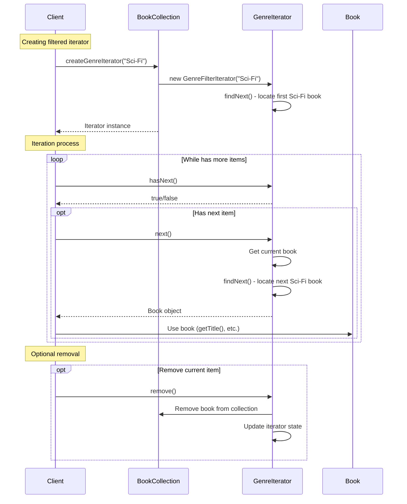

# Iterator Pattern - Class Diagram

```mermaid
classDiagram
    %% Core Iterator Interface
    class Iterator~T~ {
        <<interface>>
        +hasNext() boolean
        +next() T
        +remove() void
    }
    
    class Iterable~T~ {
        <<interface>>
        +createIterator() Iterator~T~
    }
    
    %% Book Entity
    class Book {
        -title: String
        -author: String
        -genre: String
        -year: int
        -rating: double
        +Book(String, String, String, int, double)
        +getTitle() String
        +getAuthor() String
        +getGenre() String
        +getYear() int
        +getRating() double
    }
    
    %% Book Collection
    class BookCollection {
        -books: List~Book~
        +BookCollection()
        +addBook(Book) void
        +removeBook(Book) void
        +size() int
        +createIterator() Iterator~Book~
        +createReverseIterator() Iterator~Book~
        +createGenreIterator(String) Iterator~Book~
        +createYearRangeIterator(int, int) Iterator~Book~
        +createHighRatedIterator(double) Iterator~Book~
        #getBooks() List~Book~
    }
    
    %% Concrete Iterators
    class ForwardIterator {
        -currentIndex: int
        -canRemove: boolean
        +hasNext() boolean
        +next() Book
        +remove() void
    }
    
    class ReverseIterator {
        -currentIndex: int
        -canRemove: boolean
        +ReverseIterator()
        +hasNext() boolean
        +next() Book
        +remove() void
    }
    
    class GenreFilterIterator {
        -targetGenre: String
        -currentIndex: int
        -nextBook: Book
        -canRemove: boolean
        -lastReturnedIndex: int
        +GenreFilterIterator(String)
        +hasNext() boolean
        +next() Book
        +remove() void
        -findNext() void
    }
    
    class YearRangeIterator {
        -startYear: int
        -endYear: int
        -currentIndex: int
        -nextBook: Book
        -canRemove: boolean
        -lastReturnedIndex: int
        +YearRangeIterator(int, int)
        +hasNext() boolean
        +next() Book
        +remove() void
        -findNext() void
    }
    
    class HighRatedIterator {
        -minRating: double
        -currentIndex: int
        -nextBook: Book
        -canRemove: boolean
        -lastReturnedIndex: int
        +HighRatedIterator(double)
        +hasNext() boolean
        +next() Book
        +remove() void
        -findNext() void
    }
    
    %% Tree Structure for Tree Traversal
    class TreeNode~T~ {
        -data: T
        -children: List~TreeNode~T~~
        +TreeNode(T)
        +addChild(TreeNode~T~) void
        +getData() T
        +getChildren() List~TreeNode~T~~
    }
    
    class Tree~T~ {
        -root: TreeNode~T~
        +Tree(T)
        +getRoot() TreeNode~T~
        +createIterator() Iterator~T~
        +createBreadthFirstIterator() Iterator~T~
        +createDepthFirstIterator() Iterator~T~
    }
    
    class DepthFirstIterator~T~ {
        -stack: Stack~TreeNode~T~~
        +DepthFirstIterator(TreeNode~T~)
        +hasNext() boolean
        +next() T
        +remove() void
    }
    
    class BreadthFirstIterator~T~ {
        -queue: Queue~TreeNode~T~~
        +BreadthFirstIterator(TreeNode~T~)
        +hasNext() boolean
        +next() T
        +remove() void
    }
    
    %% Utility Class
    class IteratorUtils {
        +printIterator(Iterator~T~, String) void$
        +toList(Iterator~T~) List~T~$
        +count(Iterator~T~) int$
    }
    
    %% Relationships
    Iterable <|.. BookCollection
    Iterable <|.. Tree
    
    Iterator <|.. ForwardIterator
    Iterator <|.. ReverseIterator
    Iterator <|.. GenreFilterIterator
    Iterator <|.. YearRangeIterator
    Iterator <|.. HighRatedIterator
    Iterator <|.. DepthFirstIterator
    Iterator <|.. BreadthFirstIterator
    
    BookCollection --> Book : contains
    BookCollection ..> ForwardIterator : creates
    BookCollection ..> ReverseIterator : creates
    BookCollection ..> GenreFilterIterator : creates
    BookCollection ..> YearRangeIterator : creates
    BookCollection ..> HighRatedIterator : creates
    
    Tree --> TreeNode : contains
    Tree ..> DepthFirstIterator : creates
    Tree ..> BreadthFirstIterator : creates
    
    TreeNode --> TreeNode : children
    
    ForwardIterator --> BookCollection : iterates
    ReverseIterator --> BookCollection : iterates
    GenreFilterIterator --> BookCollection : iterates
    YearRangeIterator --> BookCollection : iterates
    HighRatedIterator --> BookCollection : iterates
    
    DepthFirstIterator --> TreeNode : iterates
    BreadthFirstIterator --> TreeNode : iterates
    
    note for BookCollection
        Aggregate:
        - Multiple iterator types
        - Same collection, different traversals
        - Filter-based iterators
    end note
    
    note for GenreFilterIterator
        Filter Iterator:
        - Conditional traversal
        - Skip non-matching items
        - Lazy evaluation
    end note
    
    note for Tree
        Tree Traversal:
        - Different algorithms
        - DFS and BFS strategies
        - Hierarchical data
    end note
```

# Iterator Pattern - Sequence Diagram



## Iterator Types Demonstrated

1. **Simple Iterator**: Forward traversal with basic next/hasNext
2. **Reverse Iterator**: Backward traversal from end to beginning
3. **Filter Iterators**: Conditional traversal based on criteria
4. **Tree Iterators**: Different algorithms for hierarchical structures

## Key Features

- **Uniform Interface**: Same methods across all iterator types
- **Lazy Evaluation**: Filter iterators find items on-demand
- **Multiple Simultaneous**: Different iterators on same collection
- **Safe Removal**: Remove items during iteration safely

## Benefits Illustrated

- **Encapsulation**: Collection internals hidden from clients
- **Flexibility**: Multiple traversal strategies for same data
- **Consistency**: Same interface regardless of collection type
- **Memory Efficiency**: No need to load entire collection into memory 