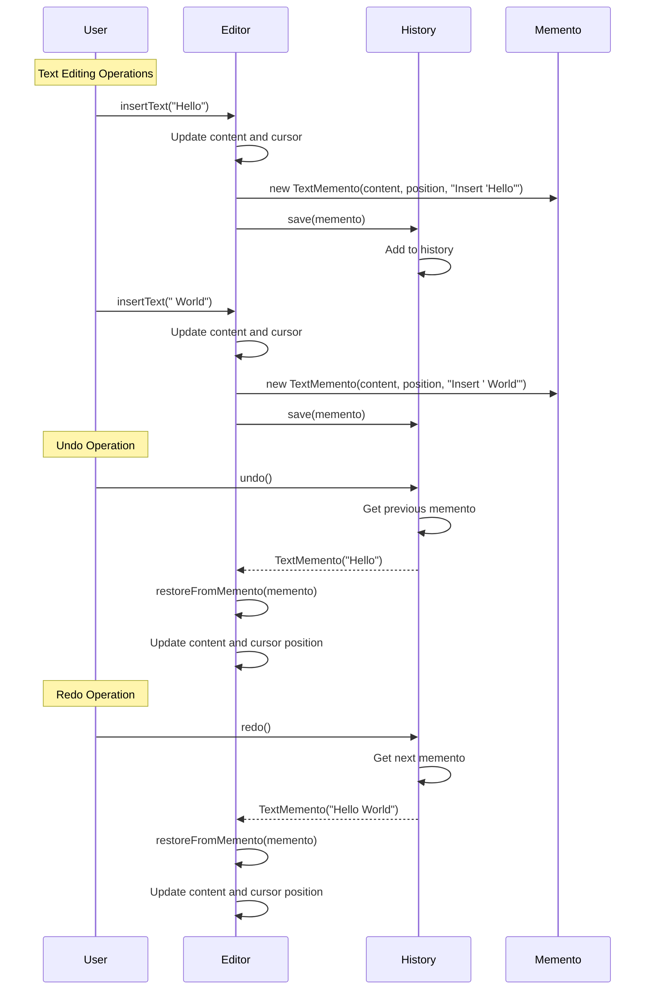
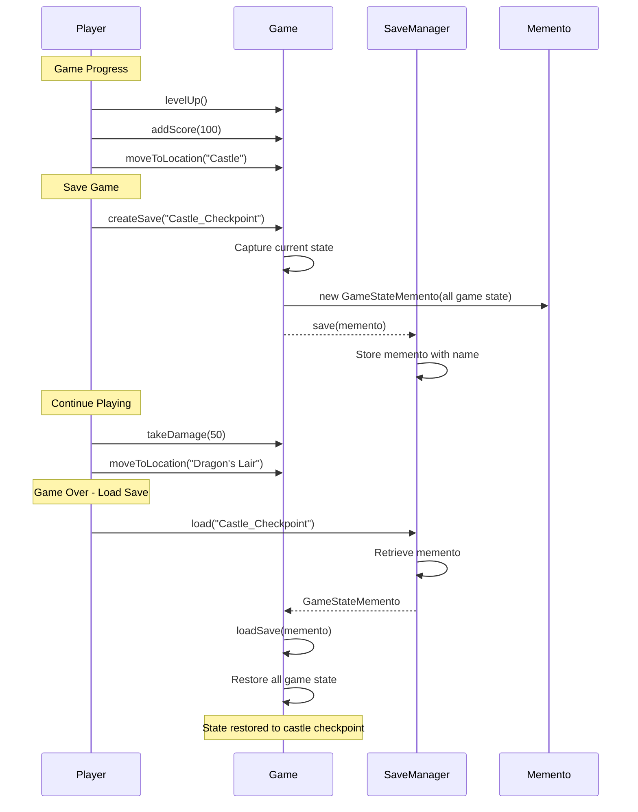

# Memento Pattern - Class Diagram

```mermaid
classDiagram
    %% Text Editor Example
    class TextMemento {
        -content: String
        -cursorPosition: int
        -timestamp: long
        -operation: String
        +TextMemento(String, int, String)
        +getContent() String
        +getCursorPosition() int
        +getTimestamp() long
        +getOperation() String
    }
    
    class TextEditor {
        -content: StringBuilder
        -cursorPosition: int
        -filename: String
        +TextEditor(String)
        +createMemento(String) TextMemento
        +restoreFromMemento(TextMemento) void
        +insertText(String) void
        +deleteText(int) void
        +moveCursor(int) void
        +replaceText(int, int, String) void
        +clear() void
        +showContent() void
        +getContent() String
        +getCursorPosition() int
        +getFilename() String
    }
    
    class EditorHistory {
        -history: List~TextMemento~
        -currentIndex: int
        -maxHistorySize: int
        +EditorHistory(int)
        +save(TextMemento) void
        +undo() TextMemento
        +redo() TextMemento
        +canUndo() boolean
        +canRedo() boolean
        +showHistory() void
        +clear() void
    }
    
    %% Game Save System
    class GameStateMemento {
        -playerName: String
        -level: int
        -health: int
        -score: int
        -inventory: Map~String,Integer~
        -location: String
        -saveTime: long
        -saveName: String
        +GameStateMemento(String, int, int, int, Map, String, String)
        +getPlayerName() String
        +getLevel() int
        +getHealth() int
        +getScore() int
        +getInventory() Map~String,Integer~
        +getLocation() String
        +getSaveTime() long
        +getSaveName() String
    }
    
    class Game {
        -playerName: String
        -level: int
        -health: int
        -score: int
        -inventory: Map~String,Integer~
        -currentLocation: String
        +Game(String)
        +createSave(String) GameStateMemento
        +loadSave(GameStateMemento) void
        +levelUp() void
        +takeDamage(int) void
        +addScore(int) void
        +addItem(String, int) void
        +useItem(String, int) void
        +moveToLocation(String) void
        +showStatus() void
    }
    
    class SaveGameManager {
        -saves: Map~String,GameStateMemento~
        -maxSaves: int
        +SaveGameManager(int)
        +save(GameStateMemento) void
        +load(String) GameStateMemento
        +deleteSave(String) void
        +listSaves() void
    }
    
    %% Relationships
    TextEditor ..> TextMemento : creates
    TextEditor <.. TextMemento : restores from
    EditorHistory --> TextMemento : manages
    
    Game ..> GameStateMemento : creates
    Game <.. GameStateMemento : restores from
    SaveGameManager --> GameStateMemento : manages
    
    note for TextMemento
        Memento Object:
        - Immutable state snapshot
        - Timestamp for history
        - Operation description
    end note
    
    note for EditorHistory
        Caretaker:
        - Manages memento lifecycle
        - Undo/redo functionality
        - Limited history size
    end note
    
    note for Game
        Originator:
        - Creates mementos
        - Restores from mementos
        - Encapsulates complex state
    end note
    
    note for SaveGameManager
        Caretaker:
        - Named save slots
        - Persistence management
        - Save file organization
    end note
```

# Memento Pattern - Sequence Diagrams

## Text Editor Undo/Redo Sequence



## Game Save/Load Sequence



## Key Memento Characteristics

1. **Encapsulation Preservation**: Memento doesn't expose originator's internal structure
2. **Immutability**: Mementos are immutable snapshots
3. **Caretaker Blindness**: Caretaker doesn't interpret memento contents
4. **State Independence**: Mementos exist independently of originator

## Benefits Demonstrated

- **Undo/Redo**: Complete operation history with state restoration
- **Checkpoints**: Save game progress at key moments
- **Recovery**: Restore from errors or unwanted changes
- **Encapsulation**: Internal state remains protected 