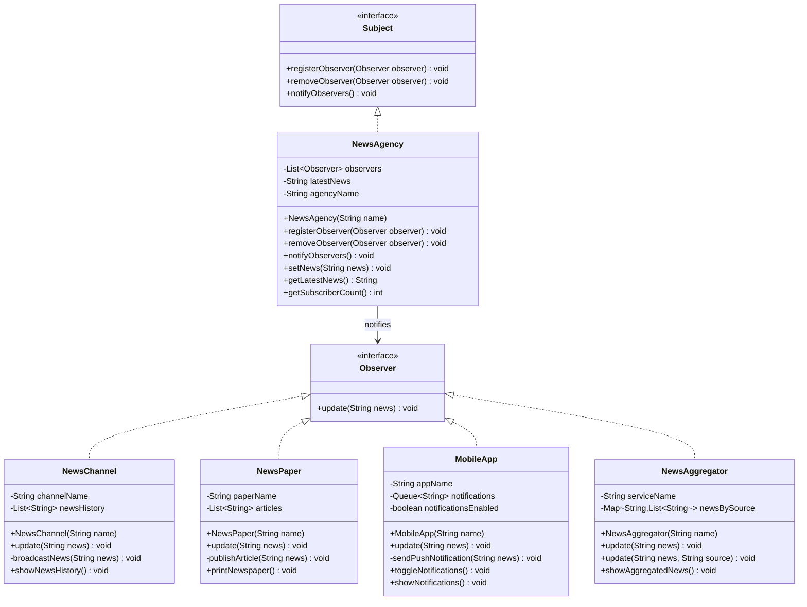
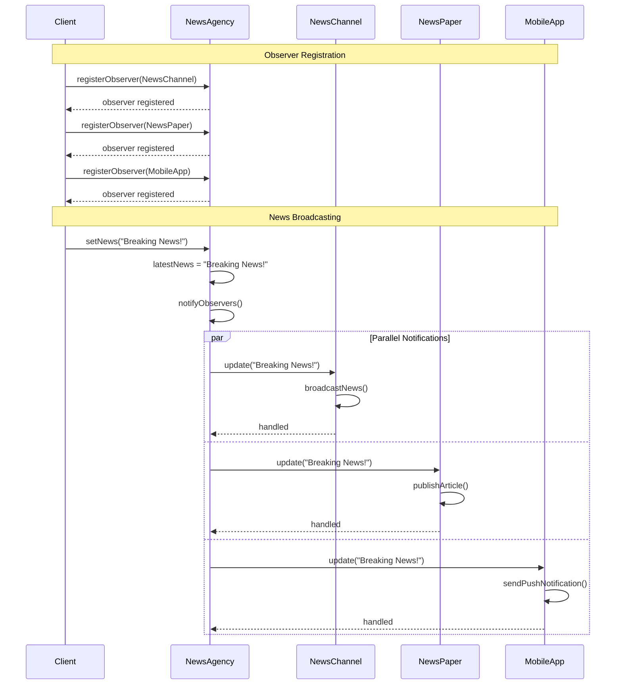
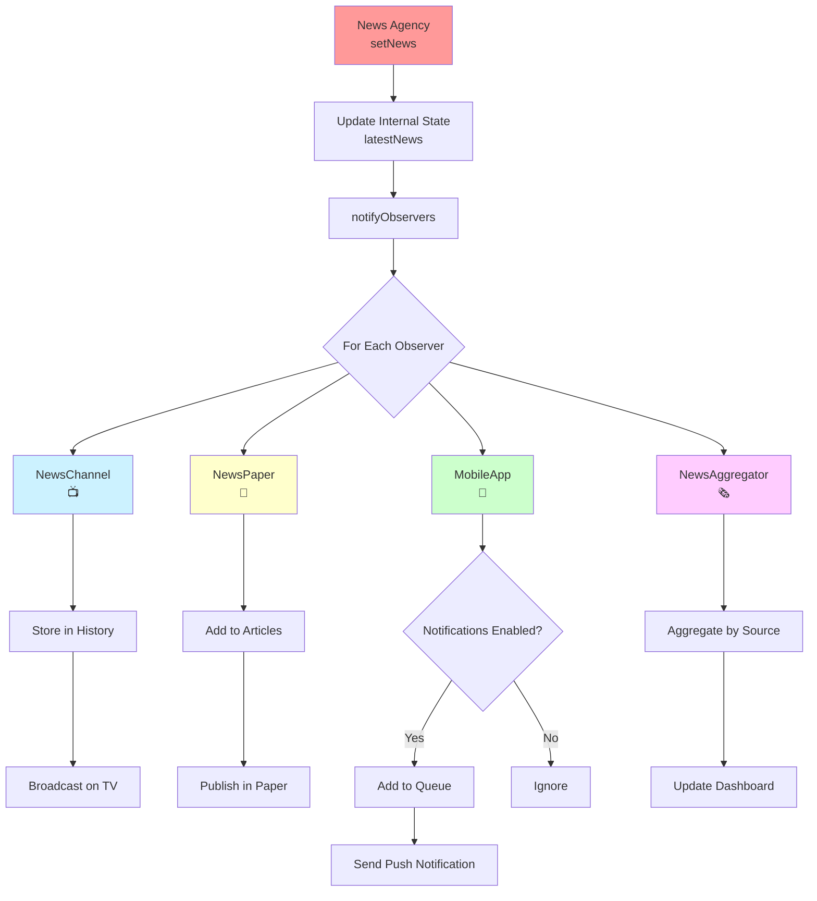
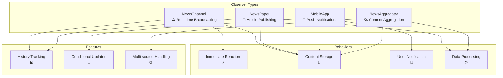
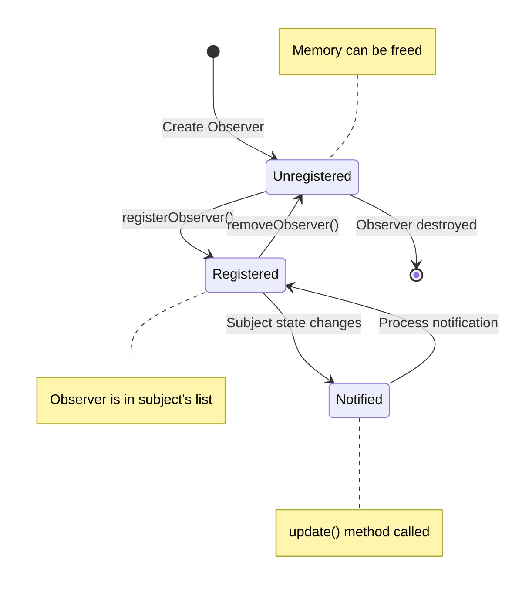
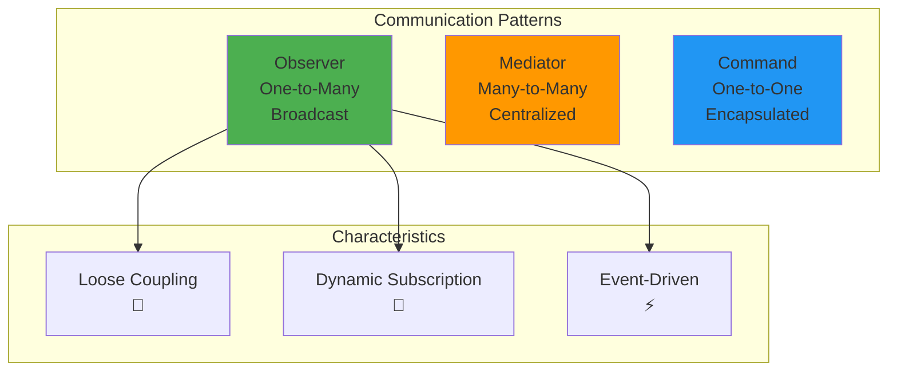
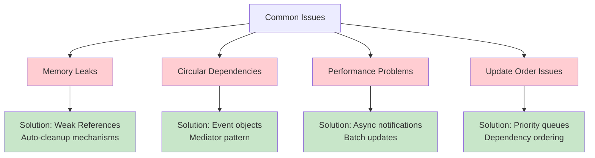

# Observer Pattern - Visual Diagrams

## 🏗️ UML Class Diagram



## 🔄 Sequence Diagram - News Broadcasting Process



## 📡 Observer Notification Flow



## 🎭 Observer Behavior Patterns



## 📊 Observer Pattern Structure

```mermaid
mindmap
  root((Observer Pattern))
    Subject Interface
      Registration
        registerObserver()
        removeObserver()
      Notification
        notifyObservers()
      State Management
        Internal state
        State changes trigger notifications
    
    Observer Interface
      Update Method
        Receive notifications
        React to changes
      Implementation Variety
        Different response behaviors
        Customizable reactions
    
    Concrete Subject
      NewsAgency
        Manage observer list
        Broadcast news updates
        Track subscriber count
    
    Concrete Observers
      NewsChannel
        Real-time broadcasting
        History tracking
      NewsPaper
        Article publishing
        Print formatting
      MobileApp
        Push notifications
        Toggle preferences
      NewsAggregator
        Multi-source aggregation
        Content organization
```

## 🔄 Observer Lifecycle Management



## 📈 Notification Performance Analysis

```mermaid
graph LR
    subgraph "Performance Factors"
        A[Number of Observers<br/>📊]
        B[Update Complexity<br/>⚙️]
        C[Notification Frequency<br/>⏱️]
    end
    
    subgraph "Performance Impact"
        D[Linear Growth<br/>O(n)]
        E[Processing Time<br/>⏳]
        F[Memory Usage<br/>💾]
    end
    
    subgraph "Optimization Strategies"
        G[Async Notifications<br/>🔄]
        H[Conditional Updates<br/>🔀]
        I[Observer Prioritization<br/>📋]
    end
    
    A --> D
    B --> E
    C --> F
    
    D --> G
    E --> H
    F --> I
    
    style A fill:#ffcccc
    style B fill:#ffcccc
    style C fill:#ffcccc
    style G fill:#ccffcc
    style H fill:#ccffcc
    style I fill:#ccffcc
```

## 🔗 Observer vs Other Patterns



## 🚨 Common Pitfalls & Solutions



## 💡 Key Design Insights

### 1. **Notification Models**
```
Push Model: Subject sends specific data
Pull Model: Subject sends minimal notification, observer pulls data
```

### 2. **Coupling Levels**
```
Tight: Observer knows specific subject type
Loose: Observer only knows interface
```

### 3. **Update Strategies**
```
Immediate: Notify observers immediately
Batched: Collect changes and notify in batches
Scheduled: Notify at specific intervals
```

---

*Visual diagrams illustrate the Observer pattern's broadcasting mechanism and the various ways observers can react to subject state changes.* 