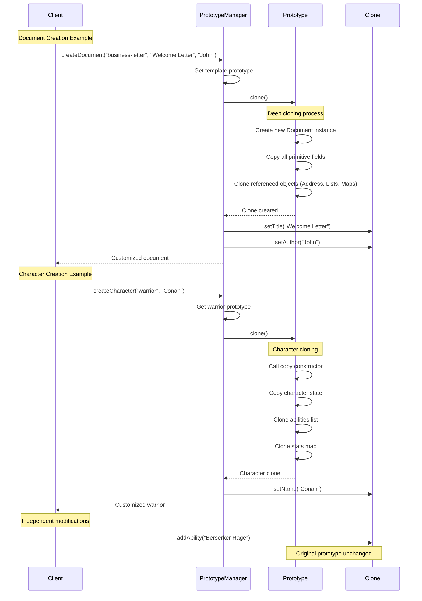

# Prototype Pattern - Class Diagram

```mermaid
classDiagram
    %% Core Prototype Interface
    class Cloneable {
        <<interface>>
        +clone() Object
    }
    
    %% Address class for composition
    class Address {
        -street: String
        -city: String
        -country: String
        -zipCode: String
        +Address(String, String, String, String)
        +Address(Address)
        +clone() Address
        +getStreet() String
        +setStreet(String) void
        +getCity() String
        +setCity(String) void
        +getCountry() String
        +setCountry(String) void
        +getZipCode() String
        +setZipCode(String) void
    }
    
    %% Document Prototype
    class Document {
        -title: String
        -content: String
        -author: String
        -createdDate: Date
        -authorAddress: Address
        -tags: List~String~
        -metadata: Map~String,String~
        +Document(String, String, String, Address)
        -Document(Document)
        +clone() Document
        +addTag(String) void
        +addMetadata(String, String) void
        +getTitle() String
        +setTitle(String) void
        +getContent() String
        +setContent(String) void
        +getAuthor() String
        +setAuthor(String) void
        +getCreatedDate() Date
        +getAuthorAddress() Address
        +getTags() List~String~
        +getMetadata() Map~String,String~
    }
    
    %% Game Character Hierarchy
    class GameCharacter {
        <<abstract>>
        #name: String
        #health: int
        #level: int
        #abilities: List~String~
        #stats: Map~String,Integer~
        #characterClass: String
        +GameCharacter(String, String)
        #GameCharacter(GameCharacter)
        +clone() GameCharacter*
        #initializeCharacter() void*
        +levelUp() void
        +addAbility(String) void
        +getName() String
        +setName(String) void
        +getHealth() int
        +setHealth(int) void
        +getLevel() int
        +getCharacterClass() String
        +getAbilities() List~String~
        +getStats() Map~String,Integer~
    }
    
    class Warrior {
        +Warrior(String)
        -Warrior(Warrior)
        +clone() Warrior
        #initializeCharacter() void
    }
    
    class Mage {
        +Mage(String)
        -Mage(Mage)
        +clone() Mage
        #initializeCharacter() void
    }
    
    class Archer {
        +Archer(String)
        -Archer(Archer)
        +clone() Archer
        #initializeCharacter() void
    }
    
    %% Prototype Managers
    class CharacterPrototypeManager {
        -prototypes: Map~String,GameCharacter~
        +CharacterPrototypeManager()
        +createCharacter(String, String) GameCharacter
        +showAvailableTypes() void
        -initializePrototypes() void
    }
    
    class DocumentTemplateManager {
        -templates: Map~String,Document~
        +DocumentTemplateManager()
        +createDocument(String, String, String) Document
        +showAvailableTemplates() void
        -initializeTemplates() void
    }
    
    %% Relationships
    Cloneable <|.. Address
    Cloneable <|.. Document
    Cloneable <|.. GameCharacter
    
    Document --> Address : contains
    
    GameCharacter <|-- Warrior
    GameCharacter <|-- Mage
    GameCharacter <|-- Archer
    
    CharacterPrototypeManager --> GameCharacter : manages
    DocumentTemplateManager --> Document : manages
    
    note for Document
        Deep Clone:
        - Clones all referenced objects
        - Independent address copy
        - Separate collections
    end note
    
    note for GameCharacter
        Template Pattern:
        - Abstract clone method
        - Initialization in subclasses
        - Copy constructor pattern
    end note
    
    note for CharacterPrototypeManager
        Prototype Registry:
        - Pre-configured prototypes
        - Factory-like creation
        - Name-based retrieval
    end note
```

# Prototype Pattern - Sequence Diagram



## Cloning Strategies Demonstrated

1. **Copy Constructor**: Safe alternative to Object.clone()
2. **Deep Cloning**: All referenced objects are cloned
3. **Prototype Registry**: Centralized management of prototype instances
4. **Template Configuration**: Pre-configured prototypes with common settings

## Benefits Illustrated

- **Performance**: Avoid expensive initialization by cloning
- **Flexibility**: Runtime prototype configuration
- **Independence**: Clones can be modified without affecting originals
- **Simplicity**: No complex factory hierarchies needed 