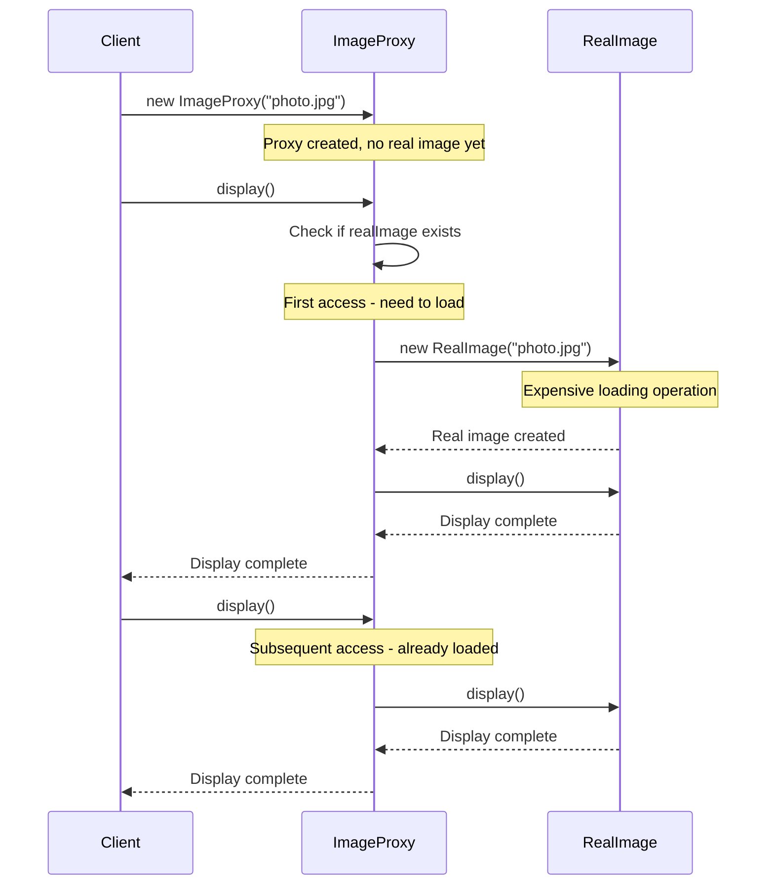
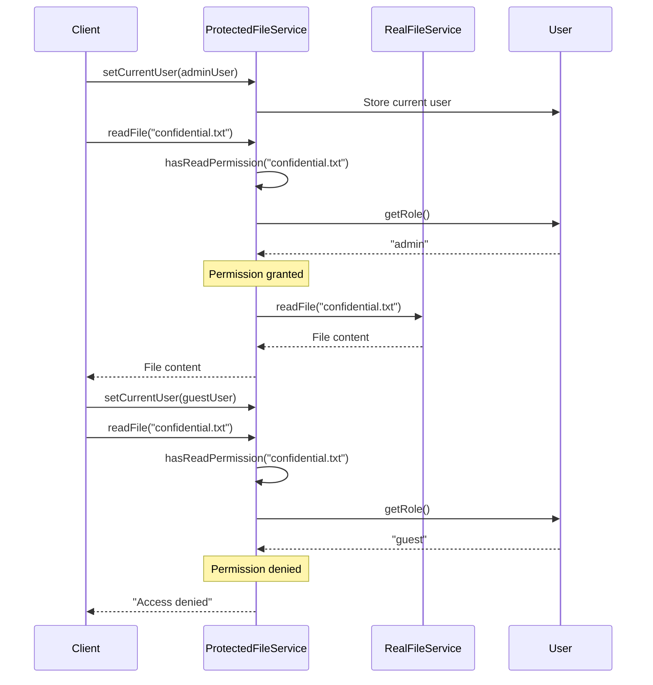

# Proxy Pattern - Class Diagram

```mermaid
classDiagram
    %% Image Proxy Example (Virtual Proxy)
    class Image {
        <<interface>>
        +display() void
        +getImageInfo() String
        +getSize() int
    }
    
    class RealImage {
        -filename: String
        -size: int
        -loaded: boolean
        +RealImage(String)
        +display() void
        +getImageInfo() String
        +getSize() int
        -loadImageFromDisk() void
    }
    
    class ImageProxy {
        -filename: String
        -realImage: RealImage
        +ImageProxy(String)
        +display() void
        +getImageInfo() String
        +getSize() int
    }
    
    %% File Service Example (Protection Proxy)
    class FileService {
        <<interface>>
        +readFile(String) String
        +writeFile(String, String) void
        +deleteFile(String) void
        +listFiles() List~String~
    }
    
    class RealFileService {
        -files: Map~String,String~
        +RealFileService()
        +readFile(String) String
        +writeFile(String, String) void
        +deleteFile(String) void
        +listFiles() List~String~
    }
    
    class ProtectedFileService {
        -realFileService: RealFileService
        -currentUser: User
        +ProtectedFileService(RealFileService)
        +setCurrentUser(User) void
        +readFile(String) String
        +writeFile(String, String) void
        +deleteFile(String) void
        +listFiles() List~String~
        -hasReadPermission(String) boolean
        -hasWritePermission(String) boolean
        -hasDeletePermission(String) boolean
    }
    
    class User {
        -username: String
        -role: String
        +User(String, String)
        +getUsername() String
        +getRole() String
    }
    
    %% Web Service Example (Caching Proxy)
    class WebService {
        <<interface>>
        +getData(String) String
        +clearCache() void
    }
    
    class RealWebService {
        +getData(String) String
        +clearCache() void
    }
    
    class CachingWebService {
        -realWebService: RealWebService
        -cache: Map~String,String~
        -cacheTimestamps: Map~String,Long~
        -cacheExpirationTime: long
        +CachingWebService(RealWebService, long)
        +getData(String) String
        +clearCache() void
        +showCacheStats() void
    }
    
    %% Relationships
    Image <|.. RealImage
    Image <|.. ImageProxy
    ImageProxy --> RealImage : creates when needed
    
    FileService <|.. RealFileService
    FileService <|.. ProtectedFileService
    ProtectedFileService --> RealFileService : delegates to
    ProtectedFileService --> User : checks permissions
    
    WebService <|.. RealWebService
    WebService <|.. CachingWebService
    CachingWebService --> RealWebService : delegates to
    
    note for ImageProxy
        Virtual Proxy:
        - Lazy loading
        - Expensive object creation
        - Transparent access
    end note
    
    note for ProtectedFileService
        Protection Proxy:
        - Access control
        - Role-based permissions
        - Security enforcement
    end note
    
    note for CachingWebService
        Caching Proxy:
        - Performance optimization
        - Response caching
        - Expiration management
    end note
```

# Proxy Pattern - Sequence Diagrams

## Virtual Proxy Sequence



## Protection Proxy Sequence



## Benefits of Each Proxy Type

1. **Virtual Proxy**: Delays expensive object creation until actually needed
2. **Protection Proxy**: Controls access based on user permissions and roles
3. **Caching Proxy**: Improves performance by storing frequently accessed data

## Key Characteristics

- **Transparent Interface**: Clients use same interface for proxy and real subject
- **Controlled Access**: Proxy controls when and how real subject is accessed
- **Additional Functionality**: Proxies can add features without changing real subject 