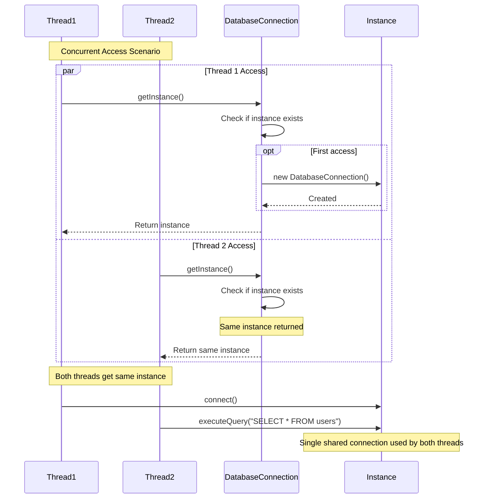

# Singleton Pattern - Class Diagram

```mermaid
classDiagram
    class DatabaseConnection {
        -instance: DatabaseConnection$
        -connectionUrl: String
        -isConnected: boolean
        -DatabaseConnection()
        +getInstance() DatabaseConnection$
        +connect() void
        +disconnect() void
        +executeQuery(String) String
        +isConnected() boolean
        +getConnectionInfo() String
    }
    
    class Logger {
        <<enumeration>>
        INSTANCE
        -logLevel: String
        -logHistory: List~String~
        +log(String) void
        +setLogLevel(String) void
        +getLogHistory() List~String~
        +clearHistory() void
    }
    
    class AppConfig {
        -instance: AppConfig$
        -properties: Map~String,String~
        -AppConfig()
        +getInstance() AppConfig$
        +getProperty(String) String
        +setProperty(String, String) void
        +loadFromFile(String) void
        +saveToFile(String) void
        +showAllProperties() void
    }
    
    class SingletonRegistry {
        -instances: Map~Class,Object~$
        +getInstance(Class~T~) T$
        +registerInstance(Class~T~, T) void$
        +clearRegistry() void$
        +showRegisteredTypes() void$
    }
    
    class SingletonTester {
        +testThreadSafety() void$
        +testEnumSingleton() void$
        +testLazySingleton() void$
        +compareInstances() void$
    }
    
    DatabaseConnection --> DatabaseConnection : instance
    AppConfig --> AppConfig : instance
    SingletonRegistry --> SingletonRegistry : instances
    
    SingletonTester ..> DatabaseConnection : tests
    SingletonTester ..> Logger : tests
    SingletonTester ..> AppConfig : tests
    
    note for DatabaseConnection
        Thread-Safe Singleton:
        - Synchronized getInstance()
        - Double-checked locking
        - Lazy initialization
    end note
    
    note for Logger
        Enum Singleton:
        - Thread-safe by default
        - Serialization safe
        - Reflection safe
    end note
    
    note for AppConfig
        Eager Initialization:
        - Instance created at class loading
        - Thread-safe
        - Simple implementation
    end note
    
    note for SingletonRegistry
        Registry Pattern:
        - Manages multiple singletons
        - Type-safe access
        - Centralized control
    end note
```

# Singleton Pattern - Thread Safety Comparison

```mermaid
graph TD
    subgraph "Lazy Initialization (Not Thread-Safe)"
        A1[getInstance called] --> A2{instance == null?}
        A2 -->|Yes| A3[Create new instance]
        A2 -->|No| A4[Return existing instance]
        A3 --> A4
        A5[Problem: Race condition between threads]
    end
    
    subgraph "Synchronized Method (Thread-Safe)"
        B1[getInstance called] --> B2[Acquire lock]
        B2 --> B3{instance == null?}
        B3 -->|Yes| B4[Create new instance]
        B3 -->|No| B5[Return existing instance]
        B4 --> B5
        B5 --> B6[Release lock]
        B7[Problem: Performance overhead on every call]
    end
    
    subgraph "Double-Checked Locking (Optimized)"
        C1[getInstance called] --> C2{instance == null?}
        C2 -->|No| C3[Return existing instance]
        C2 -->|Yes| C4[Acquire lock]
        C4 --> C5{instance == null?}
        C5 -->|Yes| C6[Create new instance]
        C5 -->|No| C7[Return existing instance]
        C6 --> C7
        C7 --> C8[Release lock]
        C9[Benefits: Thread-safe + performance]
    end
    
    subgraph "Enum Singleton (Best Practice)"
        D1[Access INSTANCE] --> D2[JVM guarantees thread safety]
        D2 --> D3[Return singleton instance]
        D4[Benefits: Simple, safe, serialization-proof]
    end
```



# Singleton Pattern - Sequence Diagram



## Singleton Implementation Strategies

1. **Eager Initialization**: Instance created at class loading time
2. **Lazy Initialization**: Instance created on first access
3. **Thread-Safe Lazy**: Synchronized access for thread safety
4. **Double-Checked Locking**: Optimized thread-safe approach
5. **Enum Singleton**: JVM-guaranteed thread safety

## Key Characteristics

- **Single Instance**: Only one instance exists throughout application
- **Global Access**: Accessible from anywhere in the application
- **Thread Safety**: Must handle concurrent access properly
- **Lazy Loading**: Optional delayed initialization for performance

## Common Use Cases Demonstrated

- **Database Connection**: Shared database access point
- **Logger**: Centralized logging system
- **Configuration**: Application-wide settings management
- **Registry**: Central repository for singleton instances 