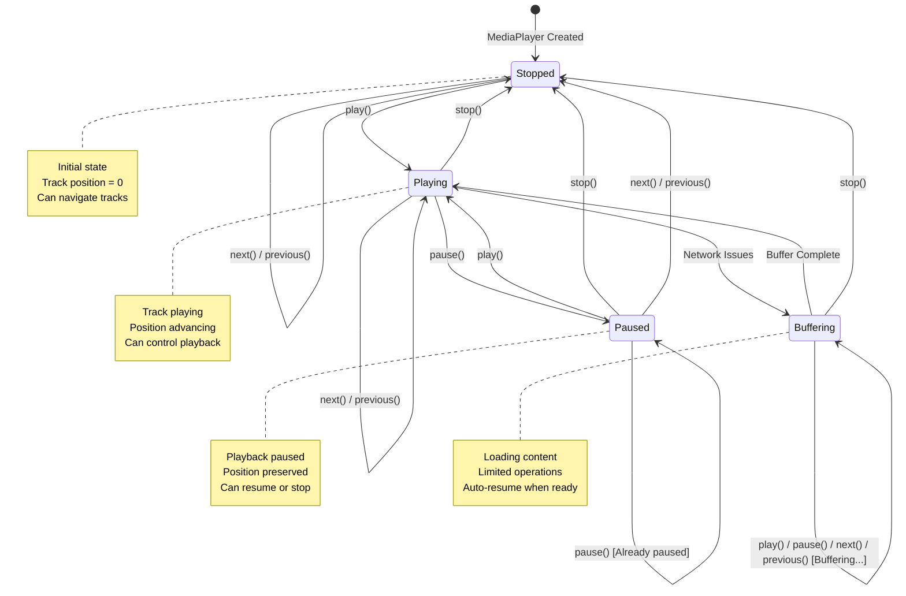
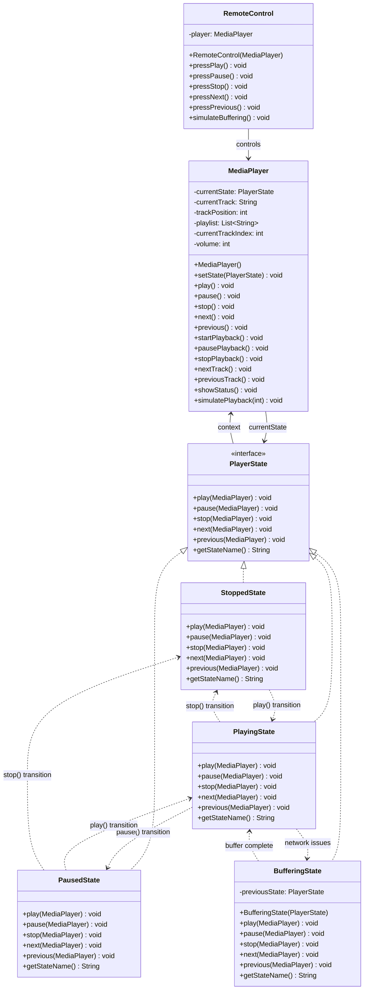

# State Pattern - State Diagram

# State Pattern - Class Diagram

## Key Features

1. **State Delegation**: MediaPlayer delegates operations to current state
2. **State Transitions**: States control when and how transitions occur
3. **Encapsulation**: Each state encapsulates specific behavior
4. **Invalid Operations**: States handle invalid operations gracefully
5. **Context Independence**: States can be reused across different contexts

## Benefits Demonstrated

- **Behavior Variation**: Same operation produces different behavior based on state
- **Clean Transitions**: State changes are controlled and predictable
- **Extensibility**: New states can be added without modifying existing code
- **Maintainability**: State-specific logic is isolated in separate classes 