# Strategy Pattern - Visual Diagrams

## 🏗️ UML Class Diagram


## 🔄 Sequence Diagram - Payment Processing


## 💳 Strategy Selection Flow


## 🎯 Strategy Pattern Structure

```mermaid
mindmap
  root((Strategy Pattern))
    Strategy Interface
      Common Contract
        pay(amount)
        getPaymentMethod()
      Algorithm Definition
        Defines what all strategies must implement
        Ensures interchangeability
    
    Concrete Strategies
      CreditCardPayment
        Card validation
        CVV checking
        Instant processing
      PayPalPayment
        Email authentication
        Password validation
        Online processing
      BankTransferPayment
        Account verification
        Routing validation
        Secure processing
      CryptoPayment
        Wallet validation
        Blockchain processing
        Conversion rates
    
    Context
      ShoppingCart
        Maintains strategy reference
        Delegates algorithm execution
        Manages business logic
        Independent of specific strategies
    
    Client Usage
      Strategy Selection
        Runtime choice
        Dynamic switching
      Business Logic
        Shopping operations
        Payment processing
```

## 🔄 Strategy Switching Visualization

```mermaid
graph LR
    subgraph "Runtime Strategy Changes"
        A[Initial: Credit Card] --> B[Switch to: PayPal]
        B --> C[Switch to: Bank Transfer]
        C --> D[Switch to: Crypto]
        D --> A
    end
    
    subgraph "Context Behavior"
        E[Same checkout() method]
        F[Same business logic]
        G[Different payment processing]
    end
    
    subgraph "Benefits"
        H[No code changes<br/>in context]
        I[Easy testing<br/>of strategies]
        J[Runtime flexibility<br/>🔄]
    end
    
    A -.-> E
    B -.-> F
    C -.-> G
    
    E --> H
    F --> I
    G --> J
    
    style A fill:#ffeb3b
    style B fill:#4caf50
    style C fill:#2196f3
    style D fill:#ff9800
```

## 📊 Strategy Comparison Matrix

```mermaid
graph TB
    subgraph "Payment Strategies Comparison"
        A[Credit Card<br/>💳]
        B[PayPal<br/>🅿️]
        C[Bank Transfer<br/>🏦]
        D[Cryptocurrency<br/>₿]
    end
    
    subgraph "Characteristics"
        E[Speed: Fast ⚡]
        F[Security: High 🔒]
        G[Fees: Low 💰]
        H[Global: Yes 🌍]
    end
    
    subgraph "Trade-offs"
        I[Convenience vs Security]
        J[Speed vs Cost]
        K[Availability vs Privacy]
    end
    
    A --> E
    A --> F
    B --> E
    B --> H
    C --> F
    C --> G
    D --> H
    D --> K
    
    E -.-> I
    F -.-> I
    G -.-> J
    E -.-> J
    H -.-> K
```



## 🔧 Implementation Patterns


## ⚡ Performance & Behavior Analysis

```mermaid
graph TD
    subgraph "Strategy Performance"
        A[Credit Card: ~100ms]
        B[PayPal: ~200ms]
        C[Bank Transfer: ~1000ms]
        D[Crypto: ~500ms]
    end
    
    subgraph "Error Handling"
        E[Card Declined<br/>Retry Logic]
        F[Auth Failed<br/>Re-authentication]
        G[Insufficient Funds<br/>Alternative Strategy]
        H[Network Error<br/>Retry Mechanism]
    end
    
    subgraph "Strategy Selection Criteria"
        I[Amount Threshold<br/>💰]
        J[User Preference<br/>👤]
        K[Security Level<br/>🔒]
        L[Processing Speed<br/>⚡]
    end
    
    A --> E
    B --> F
    C --> G
    D --> H
    
    I --> A
    J --> B
    K --> C
    L --> A
    
    style A fill:#4caf50
    style B fill:#ff9800
    style C fill:#f44336
    style D fill:#9c27b0
```



## 🎮 Strategy vs State Pattern


## 💡 Key Design Insights

### 1. **Algorithm Encapsulation**
```
Each strategy encapsulates:
- Algorithm implementation
- Validation logic
- Error handling
- Performance characteristics
```

### 2. **Context Independence**
```
Context (ShoppingCart) remains unchanged when:
- Adding new payment methods
- Modifying existing algorithms
- Changing strategy selection logic
```

### 3. **Runtime Flexibility**
```
Strategies can be:
- Selected at runtime
- Switched dynamically
- Configured based on conditions
- Tested independently
```

---

*Visual diagrams demonstrate how the Strategy pattern enables flexible algorithm selection while maintaining a consistent interface and promoting code reusability.* 