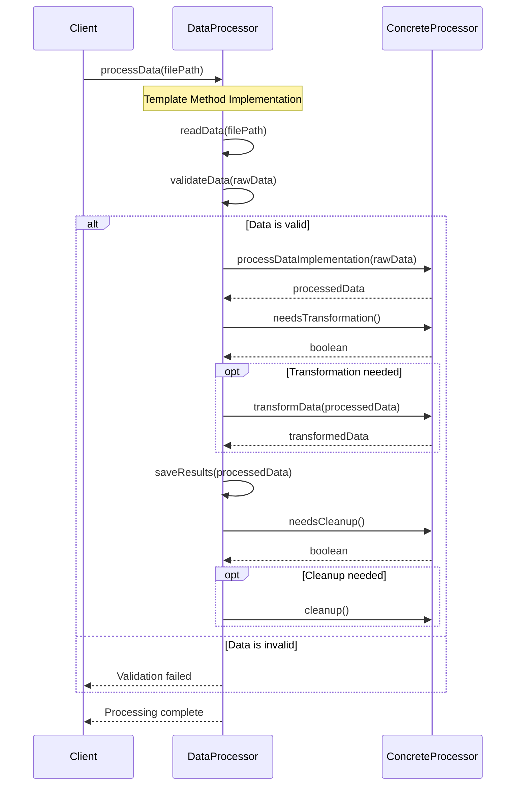

# Template Method Pattern - Class Diagram

```mermaid
classDiagram
    class DataProcessor {
        <<abstract>>
        +processData(String) void
        #readData(String) String
        #validateData(String) boolean
        #processDataImplementation(String) String*
        #transformData(String) String
        #saveResults(String) void
        #needsTransformation() boolean
        #needsCleanup() boolean
        #cleanup() void
        #getProcessorType() String*
    }
    
    class CSVDataProcessor {
        +processDataImplementation(String) String
        +needsTransformation() boolean
        +transformData(String) String
        +getProcessorType() String
    }
    
    class LogDataProcessor {
        +processDataImplementation(String) String
        +needsCleanup() boolean
        +cleanup() void
        +getProcessorType() String
    }
    
    class SurveyDataProcessor {
        +processDataImplementation(String) String
        +needsTransformation() boolean
        +transformData(String) String
        +getProcessorType() String
    }
    
    class DataProcessingManager {
        -processors: Map~String,DataProcessor~
        +DataProcessingManager()
        +processFile(String) void
        +showAvailableProcessors() void
        -determineFileType(String) String
    }
    
    DataProcessor <|-- CSVDataProcessor
    DataProcessor <|-- LogDataProcessor
    DataProcessor <|-- SurveyDataProcessor
    DataProcessingManager --> DataProcessor : manages
    
    note for DataProcessor
        Template Method: processData()
        1. readData()
        2. validateData()
        3. processDataImplementation() [abstract]
        4. transformData() [hook]
        5. saveResults()
        6. cleanup() [hook]
    end note
    
    note for CSVDataProcessor
        Specific Implementation:
        - Processes CSV format
        - Transforms to JSON
        - Row-based processing
    end note
    
    note for LogDataProcessor
        Specific Implementation:
        - Analyzes log entries
        - Categorizes by level
        - Cleanup temporary files
    end note
    
    note for SurveyDataProcessor
        Specific Implementation:
        - Statistical analysis
        - Generates visual reports
        - Survey-specific metrics
    end note
```

# Template Method Pattern - Sequence Diagram



## Algorithm Steps

1. **readData()** - Common implementation reads file content
2. **validateData()** - Common validation logic  
3. **processDataImplementation()** - Abstract method (varies by processor)
4. **transformData()** - Hook method (optional override)
5. **saveResults()** - Common implementation saves processed data
6. **cleanup()** - Hook method (optional override)

## Key Features

- **Fixed Algorithm Structure**: Template method defines invariant sequence
- **Variable Steps**: Abstract methods must be implemented by subclasses
- **Optional Steps**: Hook methods provide optional customization points
- **Code Reuse**: Common steps implemented once in base class
- **Protected Methods**: Implementation steps are protected, not public

## Benefits Demonstrated

- **Algorithm Consistency**: Same processing flow for all data types
- **Code Reuse**: Common operations implemented once
- **Flexibility**: Subclasses customize specific steps
- **Control**: Template method prevents algorithm modification 